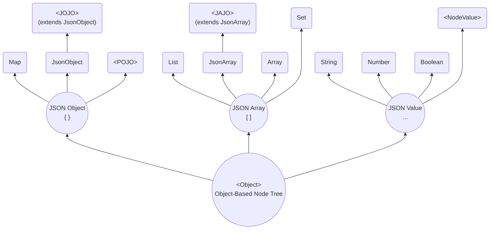

# SJF4J - Simple JSON Facade for Java


**SJF4J (Simple JSON Facade for Java)** is a simple facade over multiple JSON libraries, 
providing a unified semantic layer for structured data processing grounded in JSON specifications.  
Beyond **JSON**, it also supports **YAML**, **Properties**, and a **unified in-memory object model**.

## Table of Contents
- [Design Thinking](#design-thinking)
  - [Object-Based Node Tree](#object-based-node-tree)
  - [Why Use SJF4J](#why-use-sjf4j)
- [Getting Started](#getting-started)
  - [Installation](#installation)
  - [Starting from `JsonObject`](#starting-from-jsonobject)
  - [Path-Based Operating with `JsonPath`](#path-based-operating-with-jsonpath)
  - [Stream-Based Processing with `NodeStream`](#stream-based-processing-with-nodestream)
  - [Modeling Domain Objects with `<JOJO>`](#modeling-domain-objects-with-jojo)
  - [Converting through `Sjf4j`](#converting-through-sjf4j)
  - [Transforming with `JsonPatch`](#transforming-with-jsonpatch)
  - [Validating with `JsonSchema`](#validating-with-jsonschema)
- [Benchmark](#benchmark)
- [Contributing](#contributing)

## Design Thinking

### Object-Based Node Tree

SJF4J maps structured data into an **Object-Based Node Tree (OBNT)** and exposes a unified, expressive API
for navigation, querying, mutation, and validation.  
Unlike traditional JSON libraries that rely on dedicated AST node hierarchies,
***all nodes in SJF4J are represented as native Java objects***:



**JSON Object (`{}`)**
- **`Map`**  
A generic key-value representation using standard Java `Map`.
- **`JsonObject`**  
A lightweight wrapper around a map structure that provides JSON-semantic APIs,
and can also wrap POJO fields via getter/setter access when backed by a subclass.
- **`<POJO>`(Plain Old Java Object)**  
A strongly typed Java object with fields, getters, and setters.
- **`<JOJO>`(JSON Object Java Object)**   
A hybrid object that extends `JsonObject` while also behaving like a typed Java object,
combining the flexibility of dynamic JSON access with the safety and expressiveness of `POJOs`.

**JSON Array (`[]`)**
- **`List`**  
A standard Java `List` used as a direct representation of a JSON array.
- **`JsonArray`**  
A structured wrapper around a JSON array that provides JSON-semantic APIs.
- **`<Array>`**  
A native Java array (e.g. `String[]`, `int[]`) used when a fixed-size, 
strongly typed representation is desired.
- **`<JAJO>` (JSON Array Java Object)**  
An array type extending `JsonArray`. It is a first-class Java object that strictly represents a JSON Array,
and is suitable for domain-specific array models (e.g. `JsonPatch`).
- **`Set`**  
A Java `Set` mapped to a JSON array for compatibility, with no ordering guarantees.

**JSON Value (`..`)**
- **`String`**  - JSON `string` values.
- **`Number`**  - JSON `numeric` values, including integers and floating-point numbers.
- **`Boolean`** - JSON `true` or `false`.
- **`Null`**    - JSON `null` literal.
- **`<@NodeValue>`**  
JSON values in SJF4J are handled as typed nodes, with optional adapters for mapping to Java types (e.g. `LocalDate`).

## Getting Started

### Installation

SJF4J requires only `JDK 8` and has no external dependencies.

`Gradle`:
```groovy
implementation("org.sjf4j:sjf4j:{version}")
```

To handle ***JSON*** data, you need to add `Jackson`, `Gson`, or `Fastjson2` to your classpath. 
The first available parser in this order will be automatically used. 
If none of them are detected, SJF4J will fall back to its own simple (and slower) JSON parser.

To handle ***YAML*** data, simply include `SnakeYAML`.

To handle ***Java Properties***, there is a built-in parser.
Note that conversion from `java.util.Properties` is limited by its format restrictions. 

In ***No-Data*** scenarios, SJF4J can also ***be used without parsing any external data***.
It operates directly on in-memory object graphs via the OBNT,
providing the same JSON-semantic APIs.

### Starting from `JsonObject`
`JsonObject` is the primary entry point for interacting with **Object-Based Node Tree**, so we start from it.  

> **Note**: The APIs in SJF4J are designed to align with JSON semantics.
> For example, `hasNonNull()` for not null vs `containsKey()` for missing.

**Basic Access and mutation Methods**:

| Class      | Method                                       | Description                                                                                                                       |
|------------|----------------------------------------------|-----------------------------------------------------------------------------------------------------------------------------------|
| JsonObject | `getNode(key)` <br>                          | Returns the raw underlying node as an `Object`, without any type conversion or adaptation.                                        |
|            | `get(key, type)` <br> `getLong(key)`  ...    | `getXxx` Performs ***type-safe access*** with minimal adaptation when necessary (e.g. `Double` → `Float`, `Integer` → `Long`).    |
|            | `getAs(key, type)` <br> `getAsLong(key)` ... | `getAsXxx` Performs ***cross-type conversion***, including semantic conversions (e.g. `String` → `Number`, `Boolean` → `String`). |
|            | `put(key, value)` <br> `remove(key)` ...     | Performs mutation operations such as insert, replace, and remove.                                                                 |
|            | `toBuilder().put(..).put()`                  | Provides a builder-style API that supports fluent, chained operations.                                                            |


**Examples**:
(Full source code: [SimpleExampleTest](https://github.com/sjf4j-projects/sjf4j/blob/main/sjf4j/src/test/java/org/sjf4j/SimpleExampleTest.java))

```java
    String json = "{\n" +
            "  \"id\": 1,\n" +
            "  \"name\": \"Alice\",\n" +
            "  \"active\": true,\n" +
            "  \"tags\": [\"java\", \"json\"],\n" +
            "  \"scores\": [95, 88.8, 0.5],\n" +
            "  \"user\": {\n" +
            "    \"role\": \"coder\",\n" +
            "    \"profile\": {\n" +
            "      \"level\": 7,\n" +
            "      \"values\": [1, \"two\", true, null, { \"x\": 3 }]\n" +
            "    }\n" +
            "  }\n" +
            "}";

    JsonObject jo = JsonObject.fromJson(json);  
    // Parse JSON string to JsonObject

    Object node = jo.getNode("id");
    // Retrieve the raw node as an Object without type conversion.
    // Return null if the key is missing.

    Integer id = jo.getInteger("id");
    // Retrieve the node as a specific type using getXxx(key).
    // Performs numeric conversion within the Number hierarchy if necessary.

    double id2 = jo.getDouble("id", 0d);
    // Returns the node value, or the default if the property is null or missing.

    String name = jo.get("name", String.class);
    // Retrieve the node with an explicit type parameter.
    // Ensures type-safe casting at runtime.

    String name1 = jo.get("name");
    // Dynamic type inference version of `get()`.
    // Type is inferred based on the context, convenient for shorthand usage.

    String active = jo.getAsString("active");
    // Retrieve and convert the node value across types using `asXxx(key)`.
    // Supports cross-type casting (e.g., Number → String).

    String active2 = jo.getAs("active");
    // Dynamic type conversion, short form of `getAs(key, type)`.

    String role = jo.getJsonObject("user").get("role");
    // Chain operations for nested nodes.
    // First converts "user" node to JsonObject, then retrieves "role".

    jo.put("extra", "blabla");
    // See also: `putNonNull()`, `putIfAbsent()`, `computeIfAbsent()`

    jo.toBuilder().putIfAbsent("x", "xx").put("y", "yy");
    // Provides Builder-style chained operations.

    jo.remove("extra");
    // See also: `removeIf()`, `forEach()` etc.
```

> **Note**: `JsonArray` represents JSON Array nodes.  
> It follows the same API philosophy as `JsonObject`, including JSON-semantic access, mutation, and type conversion, 
> but applies them to ordered array elements rather than object properties.

### Path-Based Operating with `JsonPath`

`JsonPath` fully supports the [JSON Path (RFC 9535)](https://datatracker.ietf.org/doc/html/rfc9535)
/ [JSON Pointer (RFC 6901)](https://datatracker.ietf.org/doc/html/rfc6901) specifications.  

**Path-Based Methods** (in `JsonPath` and `JsonObject`/`JsonArray`)

| Class                    | Methods                                                                                                    | Description                                                                                                                                                                                                                                                                 |
|--------------------------|------------------------------------------------------------------------------------------------------------|-----------------------------------------------------------------------------------------------------------------------------------------------------------------------------------------------------------------------------------------------------------------------------|
| JsonPath                 | `JsonPath.compile(path)`                                                                                   | Compiles a JSON Path or JSON Pointer expression into a ***reusable*** `JsonPath` instance.                                                                                                                                                                                  |
|                          | `getXxx()` ... <br>  `getAsXxx()` ...                                                                      | Returns a ***single matched node***, with `getXxx()` providing type-safe access and `getAsXxx()` performing cross-type conversion. <br/> Returns `null` if no nodes found.                                                                                                  |
|                          | `find(node)` <br> `findAs(node, type)`                                                                     | Returns a ***list of matched nodes***. <br/> Returns an ***empty list*** if no nodes are matched.                                                                                                                                                                           |
|                          | `eval(node)` <br> `evalAs(node, type)`                                                                     | Returns a flexible result: <br/> - a ***single node*** if exactly one node is matched; <br/> - a ***list of nodes*** if multiple nodes are matched; <br/> - the ***function result*** if the path ends with a function call; <br/> - or ***null*** if no nodes are matched. |
|                          | `add(node, value)` <br> `replace(node, value)` <br> `remove(node)`                                         | Applies mutation operations at the path location on the target container, following JSON Patch–style semantics.                                                                                                                                                             |
|                          | `ensurePut(node, value)`                                                                                   | Ensures the path exists and inserts the value, ***creating intermediate nodes if necessary***; for arrays, appends the value when the target index equals the current array size.                                                                                           |
| JsonObject <p> JsonArray | `getByPath(path)` ... <br> `getAsByPath(path)` ... <br> `findByPath(path)` ... <br> `evalByPath(path)` ... | One-shot path evaluation APIs that compile and execute the path against the current container.                                                                                                                                                                              |
|                          | `addByPath(path, value)` <br> `removeByPath(path)` ...                                                     | One-shot path-based mutation APIs applied directly to the current container.                                                                                                                                                                                                |

**Examples**: Path-Based Access and mutation

```java
    JsonPath path = JsonPath.compile("$.user.role");
    Object role2 = path.getNode(jo);         
    // Compiles the JSONPath expression into a reusable JsonPath instance,
    // returning the single matched node without type conversion.
    
    String role3 = jo.getStringByPath("/user/role");
    // Uses a JSON Pointer expression to access the same node via a one-shot path API.
    
    String role4 = jo.getAsByPath("$..role");
    // Uses the descendant operator (`..`) to deep traversal

    List<String> tags = jo.findByPath("$.tags[*]", String.class);
    // Uses a wildcard (`*`) to match all array elements; `find()` always returns a list
    
    List<Short> scores = jo.findAsByPath("$.scores[0:3]", Short.class);
    // Uses array slicing (`[start:end:step]`)
    
    List<Object> unions = jo.findByPath("$.user['role','profile']");
    // Uses a union expression to select multiple object members

    int count = JsonPath.compile("$.scores.count()").eval(jo, int.class);
    // Evaluates the path and calls the function `count()` at the end of the path,
    // returning the number of elements in the `scores` array.

    jo.addByPath("$.aa", "bb");
    // Adds a new property to the object at the specified path
    
    jo.ensurePutNonNullByPath("$.cc.dd[0]", 100);
    // Ensures the full path exists and inserts the value, creating intermediate objects or arrays as needed. 
    // Result: {..., "cc": {"dd": [100]}}

    JsonPointer.compile("/scores/2").remove(jo);
    // Removes the element of array using `JsonPointer`.
```

**JSON Path Syntax**

| Syntax                                   | Description                                               | Example                  |
|------------------------------------------|-----------------------------------------------------------|--------------------------|
| `$`                                      | Root object                                               | `$.name`                 |
| `@`                                      | Current node (Only in Filter context)                     | `@.name`                 |
| `.name`, `['name']`                      | Object member name                                        | `$['store'].book`        |
| `[index]`                                | Array index (0-based; negative values index from the end) | `$.store['book'][0]`     |
| `.*`, `[*]`                              | Wildcard (all children)                                   | `$.store[*]`             |
| `..`                                     | Recursive descent (object or array)                       | `$..author`              |
| `[start:end]`, `[start:end:step]`        | Array slice (end exclusive)                               | `$.*.book[1:3]`          |
| `[index1, index2]`, `['name1', 'name2']` | Union of array indices or object members                  | `$.store.book[0, -1]`    |
| `[?(<filter>)]`                          | Filter expression                                         | `$..book[?@.price < 10]` |
| `func()`                                 | Function call at the end of a path or in a filter         | `$..book.size()`         |

**Filter Expressions**

| Syntax                  | Description                               | Example                                                    |
|-------------------------|-------------------------------------------|------------------------------------------------------------|
| `@`, `$`                | Path expression (automatically evaluated) | `$.orders[?(@.amount > $.config.minAmount)]`               |
| `==`, `!=`              | Equality / inequality                     | `@.category == 'fiction'`                                  |
| `<`, `<=`, `>`, `>=`    | Numeric comparison                        | `@.price >= 20`                                            |
| `&&`, `\|\|`, `!`, `()` | Logical operators and grouping            | `@.author != null \|\| ($..book.length() < 10 && !@.isbn)` |
| `=~`                    | Full regular expression match             | `@.author =~ /.*lice/i`                                    |

**Filter Functions**

| Syntax                                         | Description                                                                                                 | Example                           |
|------------------------------------------------|-------------------------------------------------------------------------------------------------------------|-----------------------------------|
| `length()`                                     | Returns the length of a string, array, or object                                                            | `$[?length(@.authors) >= 5]`      |
| `count()`                                      | Returns the number of nodes in a nodelist                                                                   | `$[?count(@.*.author) >= 5]`      |
| `match()`                                      | Tests whether a string matches a given [I-Regexp (RFC 9485)](https://datatracker.ietf.org/doc/html/rfc9485) | `$[?match(@.date, "1974-05-..")]` |
| `search()`                                     | Tests whether a string contains a substring that `match()`                                                  | `$[?search(@.author, "[BR]ob")]`  |
| `value()`                                      | Convert an instance of NodesType to a value                                                                 | `$[?value(@..color) == "red"]`    |
| `sum()`, `min()`, `max()`, `avg()`, `stddev()` | Numeric aggregation functions                                                                               | `$[?sum(@.price) < 20]`           |
| `first()`, `last()`, `index()`                 | Returns the first, last, or indexed element of an array                                                     | `$[?first(@.title) =~ /^J/]`      |

> **Extensibility**: JSON Path can be extended with custom functions via `FunctionRegistry.register()`.
> ```java
> FunctionRegistry.register(new FunctionRegistry.FunctionDescriptor("hi", args -> {
>     return "hi, " + Arrays.toString(args);
> }));
> String hi = JsonObject.fromJson("{\"aa\":\"bb\"}").evalByPath("$.hi()", String.class);
> assertEquals("hi, [J{aa=bb}]", hi);
>```

**JSON Pointer Syntax**

JSON Pointer paths always start with `/`, 
and only direct navigation is supported; no wildcards or filters.

| Syntax | Description            | Example       |
|--------|------------------------|---------------|
| /      | Root separator         | / (root)      |
| /name  | Object member access   | /store/book   |
| /0     | Array index (0-based)  | /store/book/0 |
| ~0     | Escape for ~ character | /a~0b         |
| ~1     | Escape for / character | /a~1b         |

> **Note**: `JsonPointer` is a specialized subclass of `JsonPath`.  
> It behaves identically to `JsonPath`, except that it only accepts JSON Pointer expressions.

### Stream-Based Processing with `NodeStream`
Beyond path-based access and mutation with `JsonPath` / `JsonPointer`, 
SJF4J provides a programmatic, declarative traversal and stream-based processing model.

**Example**: Use `stream()` to begin stream-style processing:
```java
List<String> tags = jo.stream()
        .findByPath("$.tags[*]", String.class)      // Path-based selection
        .filter(tag -> tag.length() > 3)            // Programmatic filtering
        .toList();
```

**Example**: Supports multi-stage evaluation:
```java
int x = jo.stream()
        .findAsByPath("$..profile", JsonObject.class)   // Primary `findAsByPath()`
        .filter(n -> n.hasNonNull("values")) 
        .getAsByPath("$..x", Integer.class)                // Secondary `asByPath()`
        .findFirst()
        .orElse(4);
```
**Example**: Programmatic aggregation and computation
```java
double avgScore = jo.stream()
        .find("$.scores[*]", Double.class)
        .map(d -> d < 60 ? 60 : d)                      // Custom normalization
        .collect(Collectors.averagingDouble(s -> s));
```

**Example**: Depth-first traversal with `walk()`
```java
jo.walk(
        Target.CONTAINER,       // Target: CONTAINER or VALUE 
        Order.BOTTOM_UP,        // Order:  BOTTOM_UP (leaf-to-root) or TOP_DOWN (root-to-leaf) 
        (path, node) -> {
            System.out.println("path=" + path + ", node=" + node);
            return Control.CONTINUE;    
            // CONTINUE to proceed, or STOP to terminate traversal
        });
```

### Modeling Domain Objects with `<JOJO>`
In real applications, data is rarely purely dynamic JSON or strictly static Java objects.  
SJF4J bridges this with `JOJO` and `JAJO` — hybrid models between `POJO` and `Map`/`List`,
combining ***typed Java fields and methods*** with ***JSON-semantic dynamic access*** in OBNT.

**Example**: `JOJO` vs `POJO` 
```java
    // Define a POJO `User`
    static class User {
        String name;
        List<User> friends;
        // Getter and setter
    }
    
    // Define a JOJO `User2`
    static class User2 extends JsonObject {
      String name;
      List<User2> friends;
      // Getter and setter
    }

    String json = "{\n" +
            "  \"name\": \"Alice\",\n" +
            "  \"friends\": [\n" +
            "    {\"name\": \"Bill\", \"active\": true },\n" +
            "    {\n" +
            "      \"name\": \"Cindy\",\n" +
            "      \"friends\": [\n" +
            "        {\"name\": \"David\"},\n" +
            "        {\"id\": 5, \"info\": \"blabla\"}\n" +
            "      ]\n" +
            "    }\n" +
            "  ],\n" +
            "  \"age\": 18\n" +
            "}\n";
    User user   = Sjf4j.fromJson(json, User.class);
    User2 user2 = Sjf4j.fromJson(json, User2.class);

    assertEquals(user.getName(), user2.getName());
    assertEquals(user.getName(), user2.getString("name"));
    // For declared fields, POJO and JOJO behave exactly the same.

    assertEquals(18, user2.getInteger("age"));
    // JOJO can still retain and access undeclared properties.
    
    System.out.println("user2=" + user2);
    // user2=@User2{*name=Alice, *friends=[@User2{*name=Bill, *friends=null, active=true}, @User2{..}], age=18}
    //                └─────────────┴─────┬─────────┴─────────────┘             └───────────┬───────────┘
    //                                    ↓                                                 ↓
    //                      Declared fields in POJO/JOJO                      Dynamic properties in JOJO

    List<String> allFriends = user2.findByPath("$.friends..name", String.class);
    // ["Bill", "Cindy", "David"]
    // JOJO provides more JSON-semantic APIs on top of the domain model!
```

#### Starting from Scratch

At an early stage, you may start with an **empty `JOJO`**:
```java
    public class Book extends JsonObject {
        // Empty at the beginning
    }
```
Although the `JOJO` is initially empty, it is already a fully functional `JsonObject`.
It can hold any JSON-like structure ***without data loss and without requiring predefined fields***.

As the system stabilizes, core properties can be progressively promoted to typed fields,
gaining compile-time safety, IDE assistance, and clearer domain semantics:
```java
    public class Book extends JsonObject {
        private String isbn;
        private String title;
    }
```
Over time, `Book` naturally evolves into a well-defined domain object,
while still retaining the ability to carry additional properties when needed.

#### Starting from an Existing Codebase

**1. Codebases based on dynamic, map-like data structures**  
This includes codebases built on Java `Map` / `List`,
Jackson `JsonNode`, Gson `JsonObject`, or Fastjson2 `JSONObject`.

Such codebases can migrate to **SJF4J’s `JsonObject`/`JsonArray`** directly,
preserving the existing data model while gaining a unified,
JSON-semantic API for traversal, querying, and mutation.


**2. Projects based on domain POJOs**  
Two common scenarios:

(1) POJOs that ***can*** extend `JsonObject`  
  When inheritance is feasible, domain classes may directly extend
  `JsonObject`. 
  Existing fields and methods remain unchanged, while the class gains
  full SJF4J capabilities.

(2) POJOs that ***cannot*** extend `JsonObject`  
This includes Java `Record`, `Protobuf` messages, or classes from external libraries.

- **Option 1: Using low-level static APIs**  
  SJF4J exposes a set of low-level, static APIs built on the **Object-Based Node Tree**.  
  These APIs operate directly on arbitrary Java object graphs 
  and are also the underlying foundation used internally by `JsonObject`/`JsonArray`.

| Helper Class | Static Methods                                                                                             | Description                                                                  |
|--------------|------------------------------------------------------------------------------------------------------------|------------------------------------------------------------------------------|
| Sjf4j        | `Sjf4j.fromJson()` ... <br> `Sjf4j.toYaml()` ...                                                           | Entry-point helpers for parsing, serialization, and cross-format conversion. |
| Nodes        | `Nodes.toLong()` ... <br> `Nodes.asString()` ... <br> `Nodes.inspect()` ...                                | Node-level access, conversion, inspection, and comparison utilities.         |
| Nodes        | `Nodes.visitObject()` <br> `Nodes.sizeInList()` <br> `Nodes.setInObject()` <br> `Nodes.removeInList()` ... | Traversal and mutation of the **Object-Based Node Tree**.                    |
| Patches      | `Patches.diff()` <br/> `Patches.merge()` ...                                                               | JSON Patch–based operations.                                                 |

**Exampl**e: Low-level static APIs
```java
    user2.forEach((k, v) -> {
        System.out.println("key=" + k + " value=" + v);
    });

    Nodes.visitObject(user, (k, v) -> {
        System.out.println("key=" + k + " value=" + v);
    });
    // Functionally equivalent to `JsonObject.forEach(...)`, but usable with any object node.
```

- **Option 2: Projecting POJO to `JsonObject`**  
  Alternatively, a POJO can be ***projected*** into a `JsonObject`,
  processed using the full JSON-semantic API,
  and then ***materialized back*** to its original type.

```java
    JsonObject userJo = JsonObject.fromNode(user);  // Project POJO as JsonObject
    ...
    user = userJo.toPojo(User.class);               // Materialize back to POJO
```
`Nodes.toXxx()` implements ***shallow copy*** (or direct references for matching types).  
`Sjf4j.readNode()`/`deepNode()` is for ***deep copy***.

> **About JAJO (JSON Array Java Object)**  
> Unlike `JOJO`, a `JAJO` extends `JsonArray`, but intentionally introduces no additional fields.  
> 
> The purpose of `JAJO` is ***modeling rather than structure***.  
> By assigning a dedicated type to an array-based JSON structure, JAJO allows domain-specific
> behavior to be expressed explicitly through methods, without altering the underlying data shape.
> 
> For example, a `JsonPatch` is fundamentally represented as a JSON array.  
> When modeled as a `JAJO`, it can naturally expose domain operations such as `diff()`,
> `apply()`, making it behave as a first-class domain object rather than a raw list.

### Converting Through `Sjf4j`
Sjf4j provides a unified set of entry-point APIs for converting between JSON-like Data and **Object-Based Node Tree**.

**Examples**: Using `Sjf4j.fromXxx()`, `Sjf4j.toXxx()` 
```java
    JsonObject jo           = Sjf4j.fromJson(json);     // = JsonObject.fromJson(json)
    Map<String, Object> map = Sjf4j.fromYaml(yaml, new TypeReference<Map<String, Object>>() {});    
    User user               = Sjf4j.fromProperties(properties, User.class);
    User2 user2             = Sjf4j.fromNode(user, User2.class);    
    // Uses reference-based mapping whenever feasible; otherwise performs a shallow copy.

    String json1            = Sjf4j.toJson(map);         
    String yaml1            = Sjf4j.toYaml(jo);         // = jo.toYaml()
    Properties props1       = Sjf4j.toProperties(user); 
    // {"aa":{"bb":[{"cc":"dd"}]}} => aa.bb[0].cc=dd

    User user1              = Sjf4j.fromNode(user2, User.class);
    // Conversion is symmetric: `fromNode(..)` is used for both directions.
    // No separate `toNode(..)` API is required.
    
    User user3              = Sjf4j.deepNode(user2);
    // Always performs a deep copy.
    // The resulting object graph is fully detached from the source.
```

**Extensibility**: SJF4J allows ***custom Java types*** to participate in OBNT via 
`@NodeValue` annotation or `ValueCodec` interface.

- **Example: Using the `@NodeValue` Annotation**
```java
    @NodeValue    
    public static class BigDay {
        private final LocalDate localDate;
        public BigDay(LocalDate localDate) {
            this.localDate = localDate;
        }

        @Encode
        public String encode() {
            return localDate.toString();
        }

        @Decode
        public static BigDay decode(String raw) {
            return new BigDay(LocalDate.parse(raw));
        }

        @Copy
        public BigDay copy() {
            return new BigDay(localDate);
        }
    }
```
- `@Encode` defines how the object is encoded into a ***raw type*** value (in OBNT).
- `@Decode` defines how the raw value is decoded back into the ***node type*** object.
- `@Copy` defines how the object is duplicated when a shallow or deep copy is required.
  
Then registering it:
```java
    NodeRegistry.registerValueCodec(BigDay.class);
    // Throws an exception if registration fails
    
    BigDay day = Sjf4j.fromJson("\"2026-01-01\"", BigDay.class);
    assertEquals("\"2026-01-01\"", Sjf4j.toJson(day));
    // After registration, `BigDay` participates in JSON parsing and serialization
    // transparently via its raw representation ("2026-01-01").
```

- **Example: Using the `ValueCodec` Interface**:  
(If annotations are not possible, e.g. JDK classes, third-party types.)
```java
    NodeRegistry.registerValueCodec(new ValueCodec<LocalDate, String>() {
        @Override
        public String encode(LocalDate node) {
            return node.toString();
        }

        @Override
        public LocalDate decode(String raw) {
            return LocalDate.parse(raw);
        }

        @Override
        public Class<LocalDate> getValueClass() {
            return LocalDate.class;
        }

        @Override
        public Class<String> getRawClass() {
            return String.class;
        }
    });
```
A `ValueCodec` explicitly specifies the value class involved in OBNT, 
its raw JSON representation (`Map`, `List`, `String`, `Number`, `Boolean`, or `null`), 
and the bidirectional conversion logic between them.


### Transforming with `JsonPatch`

`JsonPatch` provides a complete and extensible implementation of [JSON Patch (RFC 6902)](https://datatracker.ietf.org/doc/html/rfc6902),
enabling declarative, path-based modifications to the **Object-Based Node Tree**.

**Example: Applying a `JsonPatch` directly on a `JsonObject` via `apply()`**
```java
    JsonObject before = JsonObject.fromJson("{\n" +
        "  \"name\": \"Bob\",\n" +
        "  \"scores\": [90, 95, 98],\n" +
        "  \"active\": true\n" +
        "}\n");
    JsonPatch patch1 = JsonPatch.fromJson("[\n" +
        "  { \"op\": \"add\", \"path\": \"/scores/-\", \"value\": 100 },\n" +   // Appends a new element
        "  { \"op\": \"replace\", \"path\": \"/name\", \"value\": \"Alice\" },\n" +
        "  { \"op\": \"remove\", \"path\": \"/active\" }\n" +
        "]");
    before.apply(patch1);
    // Applies the `JsonPatch` directly to the `JsonObject`.

    JsonObject after = JsonObject.fromJson("{\n" +
        "  \"name\": \"Alice\",\n" +
        "  \"scores\": [90, 95, 98, 100]\n" +
        "}\n");
    assertEquals(after, before);
    // Patch operations are applied sequentially, and each operation mutates the target object in place.
```

**Example: State restoration via `JsonPatch` using `diff()` and `apply()`**
```java
    List<Integer> source = new ArrayList<>(Arrays.asList(1, 2, 3));
    List<Integer> target = new ArrayList<>(Arrays.asList(1, 5, 3, 4));
    JsonPatch patch = JsonPatch.diff(source, target);
    patch.apply(source);
    assertEquals(target, source);
    // Creates a `JsonPatch` by diffing the source and target objects,
    // then applies the patch to transform the source into the target.
```

A `JsonPatch` is essentially an ordered list of `PatchOp` operations,
and each `PatchOp` consists of four fields: `op`, `path`, `value` and `from`.

**Patch Operations**: (RFC 6902 and SJF4J extension)

| Operation   | Specification | Description                                                                             | Example                                                      |
|-------------|---------------|-----------------------------------------------------------------------------------------|--------------------------------------------------------------|
| `add`       | RFC 6902      | Adds a value at the target path                                                         | { "op": "add", "path": "/a/b/c", "value": [ "foo", "bar" ] } |
| `remove`    | RFC 6902      | Removes the value at the target path                                                    | { "op": "remove", "path": "/a/b/c" }                         |
| `replace`   | RFC 6902      | Replaces the value at the target path (must already exist)                              | { "op": "replace", "path": "/a/b/c", "value": 42 }           |
| `move`      | RFC 6902      | Moves a value from one path to another                                                  | { "op": "move", "from": "/a/b/c", "path": "/a/b/d" }         |
| `copy`      | RFC 6902      | Copies a value from one path to another                                                 | { "op": "copy", "from": "/a/b/c", "path": "/a/b/e" }         |
| `test`      | RFC 6902      | Tests whether the value at the path equals the expected value                           | { "op": "test", "path": "/a/b/c", "value": "foo" }           |
| `exist`     | SJF4J         | Asserts that the target path exists                                                     | { "op": "exist", "path": "/a/b/c" }                          |
| `ensurePut` | SJF4J         | Ensures the path exists and inserts the value, creating intermediate nodes if necessary | { "op": "ensurePut", "path": "/x/y", "value": "z" }          |


> **Extensibility**: JSON Patch can be extended with custom `PatchOp` via `PatchOpRegistry.register()`,
> and it is simple:
> ```java
> // Standard `add`
> PatchOpRegistry.register("add", (target, op) -> {
>     op.getPath().add(target, op.getValue());    // Replace with custom logic
> });
> ```

**Supporting JSON Merge Patch**

SJF4J also supports [JSON Merge Patch (RFC 7386)](https://datatracker.ietf.org/doc/html/rfc7386),
allowing partial updates to JSON objects.

| Class                                | Method                                                          | Description                                                                                                                                                                                                                                                                                                                                                |
|--------------------------------------|-----------------------------------------------------------------|------------------------------------------------------------------------------------------------------------------------------------------------------------------------------------------------------------------------------------------------------------------------------------------------------------------------------------------------------------|
| JsonObject <p> JsonArray <p> Patches | `mergeRfc7386(Object mergePatch)`                               | Following RFC 7386 semantics: <br/>• If a field exists in both the target and the patch, the patch value replaces the target value. <br/>• If a field in the patch is `null`, the corresponding target field is removed. <br/>• Nested objects are merged recursively. <br>• Arrays are replaced as a whole, not merged.                                   |
|                                      | `merge(Object mergePatch, boolean overwrite, boolean deepCopy)` | SJF4J provides a more flexible merge method: <br>• `overwrite` – if `true`, existing values are replaced; otherwise, only missing keys are added. <br>• `deepCopy` – if `true`, values are copied deeply instead of by reference. <br/>• If a field in the patch is `null`, no operation is performed. <br/>• Arrays are merged recursively, not replaced. |

### Validating with `JsonSchema`

SJF4J provides full support for [JSON Schema Draft 2020-12](https://json-schema.org/), 
and it can directly validate not only JSON / YAML data ***but also POJOs, JOJOs, Maps, Lists, 
and plain Java objects.***

**Example: Creating a `JsonSchema` and validating data**
```java
String json = "{ \"type\": \"number\" }";
JsonSchema schema = JsonSchema.fromJson(tupleSchema);
schema.compile();
// Prepares the schema for validation

ValidationResult result = schema.validate(1);
assertTrue(result.isValid());                       // Passes validation

assertFalse(schema.isValid("a"));                   // Fails validation
```

**Example: Object validation with `properties`**
```java
JsonSchema schema = JsonSchema.fromJson("{\n" +
        "  \"type\": \"object\",\n" +
        "  \"properties\": {\n" +
        "    \"name\": {\"type\": \"string\"}\n" +
        "  },\n" +
        "}");

Map<String, Object> map = Map.of("name", "Alice");
assertTrue(schema.isValid(map));                    // Map can be validated directly

MyPojo pojo = new MyPojo();
pojo.setName("Alice");
assertTrue(schema.isValid(pojo));                   // POJO validated directly
```

TBD:


## Benchmark
All benchmarks are reproducible and implemented using **JMH (Java Microbenchmark Harness)**.

### Read / Write Benchmark
The benchmark source code: [ReadBenchmark](https://github.com/sjf4j-projects/sjf4j/blob/main/sjf4j/src/jmh/java/org/sjf4j/ReadBenchmark.java)  
Sample JSON (~1KB):
```java
private static final String JSON_DATA2 = "{\n" +
        "  \"name\": \"Alice\",\n" +
        "  \"friends\": [\n" +
        "    {\"name\": \"Bill\", \"active\": true },\n" +
        "    {\n" +
        "      \"name\": \"Cindy\",\n" +
        "      \"friends\": [\n" +
        "        {\"name\": \"David\"},\n" +
        "        {\"id\": 5, \"info\": \"blabla\"}\n" +
        "      ]\n" +
        "    }\n" +
        "  ],\n" +
        "  \"age\": 18\n" +
        "}\n";
```

JMH Result:
```
Benchmark                                    Mode  Cnt  Score   Error  Units
ReadBenchmark.json_jackson_facade            avgt    5  0.750 ± 0.023  us/op
ReadBenchmark.json_jackson_native_has_any    avgt    5  0.717 ± 0.028  us/op
ReadBenchmark.json_jackson_native_map        avgt    5  0.633 ± 0.062  us/op
ReadBenchmark.json_jackson_native_no_any     avgt    5  0.458 ± 0.014  us/op
ReadBenchmark.json_gson_facade               avgt    5  1.130 ± 0.225  us/op
ReadBenchmark.json_gson_native_map           avgt    5  1.010 ± 0.054  us/op
ReadBenchmark.json_gson_native_no_any        avgt    5  0.893 ± 0.087  us/op
ReadBenchmark.json_fastjson2_facade          avgt    5  0.579 ± 0.082  us/op
ReadBenchmark.json_fastjson2_native_has_any  avgt    5  0.490 ± 0.050  us/op
ReadBenchmark.json_fastjson2_native_map      avgt    5  0.383 ± 0.008  us/op
ReadBenchmark.json_fastjson2_native_no_any   avgt    5  0.220 ± 0.011  us/op
ReadBenchmark.json_simple_facade             avgt    5  2.756 ± 0.116  us/op
```

> **Performance Summary**: Using SJF4J adds roughly **5%–10% overhead** compared with native JSON libraries, 
> while providing a unified API and extended functionality.

### Reflection Benchmark
SJF4J’s **Object-Based Node Tree** relies on reflection for flexible access to POJO/JOJO/JAJO. 
To understand the performance impact of this approach, 
we benchmarked different reflection pathways for ***constructors, getters, and setters*** in `Person` objects.  
Source code: [ReflectionBenchmark](https://github.com/sjf4j-projects/sjf4j/blob/main/sjf4j/src/jmh/java/org/sjf4j/ReflectionBenchmark.java)

JMH Result:
```
Benchmark                                            Mode  Cnt  Score    Error  Units
ReflectionBenchmark.reflection_ctor_lambda           avgt    5  0.007 ±  0.001  us/op
ReflectionBenchmark.reflection_ctor_methodHandler    avgt    5  0.008 ±  0.001  us/op
ReflectionBenchmark.reflection_ctor_native           avgt    5  0.007 ±  0.001  us/op
ReflectionBenchmark.reflection_getter_lambda         avgt    5  0.005 ±  0.001  us/op
ReflectionBenchmark.reflection_getter_methodHandler  avgt    5  0.008 ±  0.001  us/op
ReflectionBenchmark.reflection_getter_native         avgt    5  0.005 ±  0.001  us/op
ReflectionBenchmark.reflection_setter_lambda         avgt    5  0.007 ±  0.001  us/op
ReflectionBenchmark.reflection_setter_methodHandler  avgt    5  0.009 ±  0.001  us/op
ReflectionBenchmark.reflection_setter_native         avgt    5  0.007 ±  0.001  us/op
```

> **Performance Summary**: Reflection in SJF4J, when using ***lambda-based*** access, is highly efficient, 
> enabling dynamic object manipulation with ***near-native performance***.

## Contributing

SJF4J is built to *make JSON-Oriented Java Development Possible :)*  
Feel free to [open an issue](https://github.com/sjf4j-projects/sjf4j/issues/new) for questions, bugs, ideas,
or simply to say hi — your interest already means a lot to this project.  
Contributions of all kinds, whether it’s code, documentation, examples, benchmarking, or simply filing an issue, 
are truly appreciated! ❤️


## License

[MIT License](https://opensource.org/licenses/MIT)  


