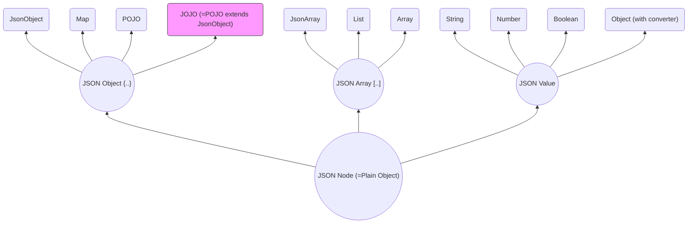

```mermaid
graph BT
    node(("JSON Node (=Plain Object)"))
    node --> object(("JSON Object {..}"))
        object --> jo("JsonObject")
        object --> map("Map")
        object --> pojo("POJO")
        object --> jojo("JOJO (=POJO extends JsonObject)")
    node --> array(("JSON Array [..]"))
        array --> ja("JsonArray")
        array --> list("List")
        array --> arr("Array")
    node --> value(("JSON Value"))
        value --> string("String")
        value --> number("Number")
        value --> boolean("Boolean")
        value --> converted("Object (with converter)")

    style jojo fill:#f9f,stroke:#333
```