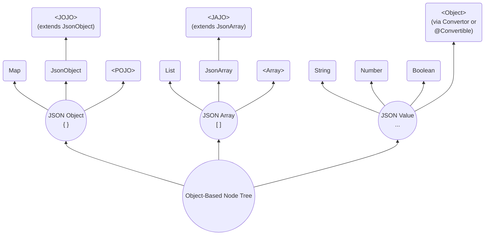

# SJF4J - Simple JSON Facade for Java

[](https://opensource.org/licenses/MIT)
[]()

## Overview

**SJF4J (Simple JSON Facade for Java)** is a lightweight facade over multiple JSON parsers
(e.g. Jackson, Gson, Fastjson2) as well as other JSON-like data parsers (e.g. SnakeYAML, Java Properties).

SJF4J maps structured data into an **Object-Based Node Tree** and exposes a unified, expressive API
for navigating, querying, validating, and mutating that tree. 
Its design follows the core data model and semantics defined by published JSON RFCs 
as well as relevant draft specifications.

> Unlike traditional JSON libraries that rely on dedicated AST node hierarchies,
> **all nodes in SJF4J are represented as native Java objects**, allowing seamless integration with existing Java code, type systems, and frameworks.



#### JSON Object (`{}`)
- **`Map`**  
A generic key-value representation using standard Java `Map`.
- **`JsonObject`**  
A lightweight wrapper around a map structure that provides JSON-oriented APIs,
and can also wrap POJO fields via getter/setter access when backed by a subclass.
- **`<POJO>`(Plain Old Java Object)**  
A strongly typed Java object with fields, getters, and setters.
- **`<JOJO>`(JSON Object Java Object)**   
A hybrid object that extends `JsonObject` while also behaving like a typed Java object,
combining the flexibility of dynamic JSON access with the safety and expressiveness of `POJOs`.

#### JSON Array (`[]`)
- **`List`**  
A standard Java `List` used as a direct representation of a JSON array.
- **`JsonArray`**  
A structured wrapper around a JSON array that provides a rich, JSON-aware API.
- **`<Array>`**  
A native Java array (e.g. `Object[]`, `String[]`, `int[]`) used when a fixed-size, 
strongly typed representation is desired.
- **`<JAJO>` (JSON Array Java Object)**  
  An array type extending `JsonArray`. It is a first-class Java object that strictly represents a JSON Array  
  (never a JSON Object), and is suitable for domain-specific array models (e.g. `JsonPatch`).

#### JSON Value (`..`)
- **`String`**  Represents JSON `string` values.
- **`Number`**  Represents JSON `numeric` values, including integers and floating-point numbers.
- **`Boolean`** Represents JSON boolean values (`true` and `false`).
- **`Null`**    Represents the JSON `null` literal.
- **`<Object>`**  
SJF4J allows JSON values to be **converted into arbitrary Java objects** through a pluggable conversion mechanism 
(via `Converter` or `@Convertible`), enabling seamless integration with **domain-specific types** (e.g. `LocalDate`).

## Getting Started

### Installation

SJF4J requires only `JDK 8` and has no external dependencies.

`Gradle`:
```groovy
implementation("org.sjf4j:sjf4j:{version}")
```

To handle ***JSON*** data, you need to add `Jackson`, `Gson`, or `Fastjson2` to your classpath. 
The first available parser in this order will be automatically used. 
If none of them are detected, SJF4J will fall back to its own simple (and slower) JSON parser.

To handle ***YAML*** data, simply include `SnakeYAML`.

To handle ***Java Properties***, there is a built-in parser.
Note that conversion from `java.util.Properties` is limited by its format restrictions. 

In ***No-Data*** scenarios, SJF4J can also **be used without parsing any external data**.
It operates directly on in-memory object graphs via the Object-Based Node Tree,
providing the same JSON-oriented APIs.

### Starting from `JsonObject`
`JsonObject` is the primary entry point for interacting with **Object-Based Node Tree**, so we start from it.  

> The APIs in SJF4J are designed to align with JSON semantics.  
> For example, `hasNonNull()` for `not null` vs `containsKey()` for missing.

**Basic Methods**:

| Method                                                        | Description                                                                                                      |
|---------------------------------------------------------------|------------------------------------------------------------------------------------------------------------------|
| `getNode(key)`                                                | Returns the raw underlying node as an `Object`, without any type conversion or adaptation.                       |
| `get(key, type)` / `getString(key)` / `getLong(key)` ...      | Performs type-safe access with minimal adaptation when necessary (e.g. `Double` → `Float`, `Integer` → `Long`).  |
| `as(key, type)` / `asString(key)` / `asLong(key)` ...         | Performs cross-type conversion, including semantic conversions (e.g. `String` → `Number`, `Boolean` → `String`). |
| `put(key, value)` / `replace(key, value)` / `remove(key)` ... | Performs mutation operations such as insert, replace, and remove.                                                |
| `builder()` / `toBuilder().put(..).put(..)`                   | Provides a builder-style API that supports fluent, chained operations.                                           |


**Examples**: (Full source code is available at
[SimpleExample](https://github.com/sjf4j-projects/sjf4j/blob/main/sjf4j/src/test/java/org/sjf4j/SimpleExample.java))

```java
    String json = "{\n" +
            "  \"id\": 1,\n" +
            "  \"name\": \"Alice\",\n" +
            "  \"active\": true,\n" +
            "  \"tags\": [\"java\", \"json\"],\n" +
            "  \"scores\": [95, 88.8, 0.5],\n" +
            "  \"user\": {\n" +
            "    \"role\": \"coder\",\n" +
            "    \"profile\": {\n" +
            "      \"level\": 7,\n" +
            "      \"values\": [1, \"two\", true, null, { \"x\": 3 }]\n" +
            "    }\n" +
            "  }\n" +
            "}";

    JsonObject jo = JsonObject.fromJson(json);  
    // Parse JSON string to JsonObject

    Object node = jo.getNode("id");
    // Retrieve the raw node as an Object without type conversion.
    // Return null if the key is missing.

    Integer id = jo.getInteger("id");
    // Retrieve the node as a specific type using getXxx(key).
    // Performs numeric conversion within the Number hierarchy if necessary.

    double id2 = jo.getDouble("id", 0d);
    // Returns the node value, or the default if the property is null or missing.

    String name = jo.get("name", String.class);
    // Retrieve the node with an explicit type parameter.
    // Ensures type-safe casting at runtime.

    String name1 = jo.get("name");
    // Dynamic type inference version of `get()`.
    // Type is inferred based on the context, convenient for shorthand usage.

    String active = jo.asString("active");
    // Retrieve and convert the node value across types using `asXxx(key)`.
    // Supports cross-type casting (e.g., Number → String).

    String active2 = jo.as("active");
    // Dynamic type conversion, short form of `as(key, type)`.

    String role = jo.asJsonObject("user").get("role");
    // Chain operations for nested nodes.
    // First converts "user" node to JsonObject, then retrieves "role".

    jo.put("extra", "blabla");
    // See also: `putNonNull()`, `putIfAbsent()`, `computeIfAbsent()`

    jo.toBuilder().putIfAbsent("x", "xx").put("y", "yy");
    // Provides Builder-style chained operations.

    jo.remove("extra");
    // See also: `removeIf()`, `forEach()` etc.
```

> **Note**: `JsonArray` represents JSON Array nodes.  
> It follows the same API philosophy as `JsonObject`, including JSON-semantic access, mutation, and type conversion, 
> but applies them to ordered array elements rather than object properties.

### Path-Based Operating with `JsonPath`/`JsonPointer`

`JsonPath` provides **full support** for the [JSON Path (RFC 9535)](https://datatracker.ietf.org/doc/html/rfc9535)
/ [JSON Pointer (RFC 6901)](https://datatracker.ietf.org/doc/html/rfc6901) specifications.  

**JSON Path Syntax**

| Syntax                                   | Description                                               | Example                  |
|------------------------------------------|-----------------------------------------------------------|--------------------------|
| `$`                                      | Root object                                               | `$`                      |
| `@`                                      | Current node (Filter context only)                        | `@.name`                 |
| `.name`, `['name']`                      | Object member name                                        | `$['store'].book`        |
| `[index]`                                | Array index (0-based; negative values index from the end) | `$.store['book'][0]`     |
| `.*`, `[*]`                              | Wildcard (all children)                                   | `$.store[*]`             |
| `..`                                     | Recursive descent (object or array)                       | `$..author`              |
| `[start:end]`, `[start:end:step]`        | Array slice (end exclusive)                               | `$.*.book[1:3]`          |
| `[index1, index2]`, `['name1', 'name2']` | Union of array indices or object members                  | `$.store.book[0, -1]`    |
| `[?(<filter>)]`                          | Filter expression                                         | `$..book[?@.price < 10]` |
| `func()`                                 | Function call at the end of a path or in a filter         | `$..book.size()`         |


**Filter Expressions**

| Syntax                  | Description                               | Example                                                    |
|-------------------------|-------------------------------------------|------------------------------------------------------------|
| `@`, `$`                | Path expression (automatically evaluated) | `$.orders[?(@.amount > $.config.minAmount)]`               |
| `==`, `!=`              | Equality / inequality                     | `@.category == 'fiction'`                                  |
| `<`, `<=`, `>`, `>=`    | Numeric comparison                        | `@.price >= 20`                                            |
| `&&`, `\|\|`, `!`, `()` | Logical operators and grouping            | `@.author != null \|\| ($..book.length() < 10 && !@.isbn)` |
| `=~`                    | Full regular expression match             | `@.author =~ /.*lice/i`                                    |

**Filter Functions**

| Syntax                                         | Description                                                                                                 | Example                           |
|------------------------------------------------|-------------------------------------------------------------------------------------------------------------|-----------------------------------|
| `length()`                                     | Returns the length of a string, array, or object                                                            | `$[?length(@.authors) >= 5]`      |
| `count()`                                      | Returns the number of nodes in a nodelist                                                                   | `$[?count(@.*.author) >= 5]`      |
| `match()`                                      | Tests whether a string matches a given [I-Regexp (RFC 9485)](https://datatracker.ietf.org/doc/html/rfc9485) | `$[?match(@.date, "1974-05-..")]` |
| `search()`                                     | Tests whether a string contains a substring that `match()`                                                  | `$[?search(@.author, "[BR]ob")]`  |
| `value()`                                      | Convert an instance of NodesType to a value                                                                 | `$[?value(@..color) == "red"]`    |
| `sum()`, `min()`, `max()`, `avg()`, `stddev()` | Numeric aggregation functions                                                                               | `$[?sum(@.price) < 20]`           |
| `first()`, `last()`, `index()`                 | Returns the first, last, or indexed element of an array                                                     | `$[?first(@.title) =~ /^J/]`      |

> **Extensibility**: Use `FunctionRegistry.register()` to add your own functions and extend JSON Path with custom logic.

**JSON Pointer Syntax**

JSON Pointer paths always start with `/`, 
and only direct navigation is supported; no wildcards or filters.

| Syntax  | Description              | Example         |
|---------|--------------------------|-----------------|
| `/`     | Root separator           | `/` (root)      |
| `/name` | Object member access     | `/store/book`   |
| `/0`    | Array index (0-based)    | `/store/book/0` |
| `~0`    | Escape for `~` character | `/a~0b`         |
| `~1`    | Escape for `/` character | `/a~1b`         |

**Path-Based Methods** (in `JsonPath` and `JsonObject`/`JsonArray`)

| Type                            | Methods                                                                                                                                        | Description                                                                                                                                                                                                                                                                 |
|---------------------------------|------------------------------------------------------------------------------------------------------------------------------------------------|-----------------------------------------------------------------------------------------------------------------------------------------------------------------------------------------------------------------------------------------------------------------------------|
| `JsonPath`                      | `JsonPath.compile(path)`                                                                                                                       | Compiles a JSON Path or JSON Pointer expression into a ***reusable*** `JsonPath` instance.                                                                                                                                                                                  |
| `JsonPath`                      | `getNode(container)` <br/> `get(container)` / ... <br/> `as(container)` / ...                                                                  | Returns a ***single matched node***, with `getXx()` providing type-safe access and `asXxx()` performing cross-type conversion. Returns `null` if no nodes found.                                                                                                            |
| `JsonPath`                      | `find(container)` <br/> `findAs(container, type)`                                                                                              | Returns a ***list of matched nodes***. Returns an ***empty list*** if no nodes are matched.                                                                                                                                                                                 |
| `JsonPath`                      | `eval(container)` <br/> `evalAs(container, type)`                                                                                              | Returns a flexible result: <br/> - a ***single node*** if exactly one node is matched; <br/> - a ***list of nodes*** if multiple nodes are matched; <br/> - the ***function result*** if the path ends with a function call; <br/> - or ***null*** if no nodes are matched. |
| `JsonPath`                      | `add(container, value)` <br/> `replace(container, value)` <br/> `remove(container)`                                                            | Applies mutation operations at the path location on the target container, following JSON Patch–style semantics.                                                                                                                                                             |
| `JsonPath`                      | `ensurePut(container, value)`                                                                                                                  | Ensures the path exists and inserts the value, ***creating intermediate nodes if necessary***; for arrays, appends the value when the target index equals the current array size.                                                                                           |
| `JsonObject`/ <br/> `JsonArray` | `getNodeByPath(path)` <br/> `getByPath(path)` / ... <br/> `asByPath(path)` / ... <br/> `findByPath(path)` / ... <br/> `evalByPath(path)` / ... | One-shot path evaluation APIs that compile and execute the path against the current container.                                                                                                                                                                              |
| `JsonObject`/ <br/> `JsonArray` | `addByPath(path, value)` <br/> `replaceByPath(path, value)` <br/> `removeByPath(path)` <br/> `ensurePut(path, vlaue)`                          | One-shot path-based mutation APIs applied directly to the current container.                                                                                                                                                                                                |

**Examples**: Path-Based Access and mutation

```java
    JsonPath jp = JsonPath.compile("$.user.role");
    Object role2 = jp.getNode(jo);         
    // Compiles the JSONPath expression into a reusable JsonPath instance,
    // returning the single matched node without type conversion.
    
    String role3 = jo.getStringByPath("/user/role");
    // Uses a JSON Pointer expression to access the same node via a one-shot path API.
    
    String role4 = jo.asByPath("$..role");
    // Uses the descendant operator (`..`) to deep traversal

    List<String> tags = jo.findByPath("$.tags[*]", String.class);
    // Uses a wildcard (`*`) to match all array elements; `find()` always returns a list
    
    List<Short> scores = jo.findAsByPath("$.scores[0:3]", Short.class);
    // Uses array slicing (`[start:end:step]`)
    
    List<Object> unions = jo.findNodesByPath("$.user['role','profile']");
    // Uses a union expression to select multiple object members

    int count = JsonPath.compile("$.scores.count()").eval(jo, int.class);
    // Evaluates the path and calls the function `count()` at the end of the path,
    // returning the number of elements in the `scores` array.

    jo.addByPath("$.aa", "bb");
    // Adds a new property to the object at the specified path
    
    jo.ensurePutNonNullByPath("$.cc.dd[0]", 100);
    // Ensures the full path exists and inserts the value, creating intermediate objects or arrays as needed. 
    // Result: {..., "cc": {"dd": [100]}}

    JsonPointer.compile("/scores/2").remove(jo);
    // Removes the element of array using `JsonPointer`.
```

> **Note**: `JsonPointer` is a specialized subclass of `JsonPath`.  
> It behaves identically to `JsonPath`, except that it only accepts JSON Pointer expressions.

### Stream-Based Programmatic Processing

Beyond path-based access and mutation with `JsonPath` / `JsonPointer`, 
SJF4J provides a higher-level, declarative traversal and stream-based processing model.

**Example**: Depth-first traversal with `walk()`
```java
jo.walk(
        Target.CONTAINER,       // Target: CONTAINER or VALUE 
        Order.BOTTOM_UP,        // Order:  BOTTOM_UP (leaf-to-root) or TOP_DOWN (root-to-leaf) 
        (path, node) -> {
            System.out.println("path=" + path + ", node=" + node);
            return Control.CONTINUE;    
            // CONTINUE to proceed, or STOP to terminate traversal
        });
```

**Example**: Use `stream()` to begin Java Stream-style processing:
```java
List<String> tags = jo.stream()
        .findByPath("$.tags[*]", String.class)      // Path-based selection
        .filter(tag -> tag.length() > 3)            // Programmatic filtering
        .toList();
```

**Example**: Supports multi-stage evaluation:
```java
int x = jo.stream()
        .findAsByPath("$..profile", JsonObject.class)   // Primary `findAsByPath()`
        .filter(n -> n.hasNonNull("values")) 
        .asByPath("$..x", Integer.class)                // Secondary `asByPath()`
        .findFirst()
        .orElse(4);
```
**Example**: Programmatic aggregation and computation
```java
double avgScore = jo.stream()
        .find("$.scores[*]", Double.class)
        .map(d -> d < 60 ? 60 : d)                      // Custom normalization
        .collect(Collectors.averagingDouble(s -> s));
```

### Diffing and Merging with `JsonPatch`

`JsonPatch` provides a complete and extensible implementation of [JSON Patch (RFC 6902)](https://datatracker.ietf.org/doc/html/rfc6902), 
enabling declarative, path-based modifications to the **Object-Based Node Tree**.

**Example**: Applying a `JsonPatch` directly on a `JsonObject` via `apply()`
```java
    JsonObject before = JsonObject.fromJson("{\n" +
        "  \"name\": \"Bob\",\n" +
        "  \"scores\": [90, 95, 98],\n" +
        "  \"active\": true\n" +
        "}\n");
    JsonPatch patch1 = JsonPatch.fromJson("[\n" +
        "  { \"op\": \"add\", \"path\": \"/scores/-\", \"value\": 100 },\n" +   // Appends a new element
        "  { \"op\": \"replace\", \"path\": \"/name\", \"value\": \"Alice\" },\n" +
        "  { \"op\": \"remove\", \"path\": \"/active\" }\n" +
        "]");
    before.apply(patch1);
    // Applies the `JsonPatch` directly to the `JsonObject`.

    JsonObject after = JsonObject.fromJson("{\n" +
        "  \"name\": \"Alice\",\n" +
        "  \"scores\": [90, 95, 98, 100]\n" +
        "}\n");
    assertEquals(after, before);
    // Patch operations are applied sequentially, and each operation mutates the target object in place.
```

**Example**: State restoration via `JsonPatch` using `diff()` and `apply()`
```java
    List<Integer> source = new ArrayList<>(Arrays.asList(1, 2, 3));
    List<Integer> target = new ArrayList<>(Arrays.asList(1, 5, 3, 4));
    JsonPatch patch = JsonPatch.diff(source, target);
    patch.apply(source);
    assertEquals(target, source);
    // Creates a `JsonPatch` by diffing the source and target objects,
    // then applies the patch to transform the source into the target.
```

A `JsonPatch` is essentially an ordered list of `PatchOp` operations, 
and each `PatchOp` consists of four fields: `op`, `path`, `value` and `from`.

**Patch Operations**: (RFC 6902 and SJF4J extension)

| Operation   | Specification | Description                                                                             | Example                                                        |
|-------------|---------------|-----------------------------------------------------------------------------------------|----------------------------------------------------------------|
| `add`       | RFC 6902      | Adds a value at the target path                                                         | `{ "op": "add", "path": "/a/b/c", "value": [ "foo", "bar" ] }` |
| `remove`    | RFC 6902      | Removes the value at the target path                                                    | `{ "op": "remove", "path": "/a/b/c" }`                         |
| `replace`   | RFC 6902      | Replaces the value at the target path (must already exist)                              | `{ "op": "replace", "path": "/a/b/c", "value": 42 }`           |
| `move`      | RFC 6902      | Moves a value from one path to another                                                  | `{ "op": "move", "from": "/a/b/c", "path": "/a/b/d" }`         |
| `copy`      | RFC 6902      | Copies a value from one path to another                                                 | `{ "op": "copy", "from": "/a/b/c", "path": "/a/b/e" }`         |
| `test`      | RFC 6902      | Tests whether the value at the path equals the expected value                           | `{ "op": "test", "path": "/a/b/c", "value": "foo" }`           |
| `exist`     | SJF4J         | Asserts that the target path exists                                                     | `{ "op": "exist", "path": "/a/b/c" }`                          |
| `ensurePut` | SJF4J         | Ensures the path exists and inserts the value, creating intermediate nodes if necessary | `{ "op": "ensurePut", "path": "/x/y", "value": "z" }`          |

> **Extensibility**: Use `PatchOpRegistry.register()` to define your own patch operations.

It is simple to define a custom operation:
```java
    // Standard RFC `add`
    PatchOpRegistry.register("add", (target, op) -> {
        op.getPath().add(target, op.getValue());    // Replace with your own custom logic
    });
```

#### Supporting JSON Merge Patch

SJF4J also supports [JSON Merge Patch (RFC 7386)](https://datatracker.ietf.org/doc/html/rfc7386), 
allowing partial updates to JSON objects.

| Method                                                          | Description                                                                                                                                                                                                                                                                                                                                                |
|-----------------------------------------------------------------|------------------------------------------------------------------------------------------------------------------------------------------------------------------------------------------------------------------------------------------------------------------------------------------------------------------------------------------------------------|
| `mergeRfc7386(Object mergePatch)`                               | Following RFC 7386 semantics: <br/>• If a field exists in both the target and the patch, the patch value replaces the target value. <br/>• If a field in the patch is `null`, the corresponding target field is removed. <br/>• Nested objects are merged recursively. <br>• Arrays are replaced as a whole, not merged.                                   |
| `merge(Object mergePatch, boolean overwrite, boolean deepCopy)` | SJF4J provides a more flexible merge method: <br>• `overwrite` – if `true`, existing values are replaced; otherwise, only missing keys are added. <br>• `deepCopy` – if `true`, values are copied deeply instead of by reference. <br/>• If a field in the patch is `null`, no operation is performed. <br/>• Arrays are merged recursively, not replaced. |

`JsonObject` / `JsonArray` provides these two merge methods.  
For native node objects, you can use `PatchUtil.merge()`/`PatchUtil.mergeRfc7386()` directly.

### Validating with `JsonSchema`

TODO

### Modeling Domain Objects with `<JOJO>`/`<JAJO>`

In many real-world applications, data is neither purely dynamic JSON nor strictly static Java objects.  
SJF4J addresses this gap by introducing `JOJO` (JSON Object Java Object) and `JAJO` (JSON Array Java Object)—
hybrid domain models that combine ***typed Java structures*** with ***JSON-style dynamic access***.

A `JOJO` is a Java class that extends `JsonObject`, while a `JAJO` extends `JsonArray`.  
They participate in the **Object-Based Node Tree** like any other node, but also expose ***strongly typed fields, 
methods, and domain logic***, making them ideal for modeling application-level entities.

**Example**: `JOJO` vs `POJO` 
```java
    // Define a POJO `User`
    @Getter @Setter
    static class User {
        String name;
        List<User> friends;
    }
    
    // Define a JOJO `User2`
    @Getter @Setter
    static class User2 extends JsonObject {
      String name;
      List<User2> friends;
    }

    String json = "{\n" +
            "  \"name\": \"Alice\",\n" +
            "  \"friends\": [\n" +
            "    {\"name\": \"Bill\", \"active\": true },\n" +
            "    {\n" +
            "      \"name\": \"Cindy\",\n" +
            "      \"friends\": [\n" +
            "        {\"name\": \"David\"},\n" +
            "        {\"id\": 5, \"info\": \"blabla\"}\n" +
            "      ]\n" +
            "    }\n" +
            "  ],\n" +
            "  \"age\": 18\n" +
            "}\n";
    User user = Sjf4j.fromJson(json, User.class);
    User2 user2 = Sjf4j.fromJson(json, User2.class);

    assertEquals(user.getName(), user2.getName());
    assertEquals(user.getName(), user2.getString("name"));
    // For declared fields, POJO and JOJO behave exactly the same.

    assertEquals(18, user2.getInteger("age"));
    // JOJO can still retain and access undeclared properties.
    
    System.out.println("user2=" + user2);
    // user2=@User2{*name=Alice, *friends=L[@User2{*name=Bill, *friends=null, active=true}, @User2{..}], age=18}
    //                └─────────────┴─────┬──────────┴─────────────┘             └───────────┬───────────┘
    //                                    ↓                                                  ↓
    //                      Declared fields in POJO/JOJO                      Dynamic properties in JOJO

    List<String> allFriends = user2.findByPath("$.friends..name", String.class);
    // =["Bill", "Cindy", "David"]
    // JOJO provides more JSON-oriented APIs on top of the domain model!
```

#### Practices: Starting from Scratch

At an early stage, you may start with an **empty `JOJO`**:
```java
public class Book extends JsonObject {
    // Empty at the beginning
}
```
Although the `JOJO` is initially empty, it is already a fully functional `JsonObject`.
It can hold any JSON-like structure ***without data loss and without requiring predefined fields***.

As the system stabilizes, core properties can be progressively promoted to typed fields,
gaining compile-time safety, IDE assistance, and clearer domain semantics:
```java
public class Book extends JsonObject {
    private String isbn;
    private String title;
}
```
Over time, `Book` naturally evolves into a well-defined domain object,
while still retaining the ability to carry additional properties when needed.

#### Practices: Starting from an Existing Project

**1.** If projects based on dynamic map-like data structures, 
such as Java `Map` / `List`, Jackson `JsonNode`, Gson `JsonObject`, Fastjson2 `JSONObject`.

Such projects may migrate to **SJF4J’s `JsonObject`**,
preserving the original data model while gaining a unified, JSON-oriented API
for traversal, querying, and mutation.

**2.** If projects based on domain `POJOs`, 又分为两种情况.

   - If `POJOs` **can** extend `JsonObjet`, just let the `POJOs` directly extend `JsonObject`.  


   - If `POJOs` **cannot** extend `JsonObjet`, 
   such as Java `Record`, `Protobuf` messages, or classes from external libraries


### Converting Between JSON-like Data and Java Objects

### Example with POJO / JOJO

```java
    // POJO example
    class User {
        int id;
        String name;
        List<User> friends;
    }

    // JOJO example
    class User2 extends JsonObject {
        int id;
        String name;
        List<User2> friends;
    }

    String json = "{\n" +
            "  \"id\": 1,\n" +
            "  \"name\": \"Alice\",\n" +
            "  \"friends\": [\n" +
            "    { \"id\": 2, \"name\": \"Bill\", \"active\": true },\n" +
            "    {\n" +
            "      \"id\": 3,\n" +
            "      \"name\": \"Cindy\",\n" +
            "      \"friends\": [\n" +
            "        {\"id\": 4, \"name\": \"Dino\"},\n" +
            "        {\"id\": 5, \"info\": \"bla bla\"}\n" +
            "      ]\n" +
            "    }\n" +
            "  ],\n" +
            "  \"age\": 18\n" +
            "}\n";
```

Converting between data `Input` and `JsonObject` / `Map` / `POJO` / `JOJO`.
```java
    JsonObject jo = Sjf4j.fromJson(json);               // = JsonObject.fromJson(json), to JsonObject
    Map<String, Object> map = Sjf4j.fromJson(json,      // to Map
            new TypeReference<Map<String, Object>>() {});    
    User user = Sjf4j.fromJson(json, User.class);       // to POJO
    User2 user2 = Sjf4j.fromJson(json, User2.class);    // to JOJO

    // Serialize back to JSON
    System.out.println("jo=" + jo.toJson());            // = Sjf4j.toJson(jo)
    System.out.println("map=" + Sjf4j.toJson(map));     // Output dynamic nodes in Map
    System.out.println("user=" + Sjf4j.toJson(user));   // Only outputs fields defined in User
    System.out.println("user2=" + user2.toJson());
    // Outputs both fixed fields in User2 and dynamic nodes in super JsonObject

    // YAML is handled the same way as JSON
    jo = JsonObject.fromYaml(jo.toYaml());

    // Limited conversion to/from Properties:
    jo.toProperties(System.getProperties());    // {"aa":{"bb":[{"cc":"dd"}]}} => aa.bb[0].cc=dd                
    
```

Converting between `JsonObject`, `Map`, `POJO`, and `JOJO`.
```java
    // JsonObject <==> Map
    Map<String, Object> tmpMap = jo.toMap();
    tmpJo = new JsonObject(map);    // Just wrap it

    // JsonObject <==> POJO/JOJO
    User tmpUser = jo.toPojo(User.class);
    tmpJo = Sjf4j.fromPojo(user2);
    
    // JOJO <==> POJO
    tmpUser = user2.toPojo(User.class);
    User2 tmpUser2 = Sjf4j.fromPojo(user, User2.class);
```
`JOJO` inherits all APIs from super class `JsonObject`, and also has `Getters` / `Setters` of `POJO`.
They are fully equivalent.

> **Key point**: `JOJO` combines the **type-safe, high-performance nature** of `POJOs` with
> the **dynamic flexibility** of `Maps`.  
It may enable a script-like Java development experience and is highly recommended.

```java
    System.out.println("keys=" + user2.keySet());
    // ["id",  "name",  "friends",  "age"]
    //   └────────┼─────────┘         │
    //            ↓                   ↓
    //      Fields in POJO       Property in JsonObject
        
    System.out.println("name=" + user2.getName());
    // = user2.getString("name"));

    user2.put("name", "Jenny");
    // = user2.setName("Jenny")

    String bill = user2.getFriends().get(0).getName();
    // = user2.getStringByPath("$.friends[0].name")

    int allUsers = user2.findAllNodes("$..id").size();
    // Use advanced APIs provided by JsonObject
```

---
### Starting from Scratch

**1. Early Stage: Use `JsonObject` or an Empty `JOJO`**  
At the beginning, you can simply use `JsonObject`, or define an empty `JOJO` class:
```java
public class Book extends JsonObject {
    // Empty here
}
```
An empty `JOJO` is equivalent to a plain `JsonObject`:
it can store any JSON-like structure without loss and without predefined fields.

**2. Scaling Up: Two Upgrade Paths**  
As your project grows, you may want stronger structure, type safety, or better performance.
There are two upgrade paths:

 - **Path A — Evolve Toward a POJO**

Gradually “solidify” frequently used properties into strongly typed POJO fields.
This improves performance and enables static type checking while keeping flexibility for other fields.
```java
@Getter @Setter
public class Person extends JsonObject {
    private String name;    // Solidified as a field for the best performance
    private int age;

    // All other properties continue to exist inside JsonObject storage
}
```
This hybrid design allows you to ***transition from dynamic to static structure*** without losing compatibility.

 - **Path B — Use @Jojo Annotatio to codegen** (Not Yet Implemented - -! )

You can annotate a class with `@Jojo` to automatically generate `Getters` / `Setters`
(and possibly other convenience methods).
```java
@Jojo({
        @Property(name = "name", type = String.class),
        @Property(name = "age", type = int.class, comment = "by years")
})
public class Person extends JsonObject {
    
}
```
Internally it is still Map-based, but with compile-time validation and `IDE` support.

> Code generation is not yet implemented. Contributions are very welcome! 🙏

---
### From an Existing Project

**1. If your project currently uses a dynamic map-like type**  
(e.g., `Map/List`, `ObjectNode` in Jackson, `JsonObject` in Gson, `JSONObject` in Fastjson2):

You may switch to **SJF4J’s** `JsonObject` if you want:
- unified API across libraries
- path-based and more convenient operations
- interoperability with POJO / JOJO
- JSON / YAML / Properties conversion

**2. If your project already uses POJOs**  
There are two scenarios:

 1. Your POJO ***can*** extend `JsonObject`  

If inheritance is allowed, simply let your POJO extend `JsonObject`.  
You keep all existing fields and methods, while gaining full SJF4J capabilities.

 2. Your POJO ***cannot*** extend `JsonObject`  
(e.g., Java Record, ProtoBuf Message, classes from external libraries)

Then you must use ***copy-based wrapping***:
```java
    JsonObject jo = new JsonObject(myPojo);     // Shallow wrapper
    ...
    myPojo = jo.toPojo(Person.class);           // Copy back to POJO
```

In the future, annotation-based code generation may offer POJO-style accessors like this:
```java
@Jojo(target = Person.class)
public class PersonJo extends JsonObject {

}
```

## Contributing

SJF4J is built to *make Java Development more enjoyable :)*  
Feel free to [open an issue](https://github.com/sjf4j-projects/sjf4j/issues/new) for questions, bugs, ideas,
or simply to say hi — your interest already means a lot to this project.  
Contributions of all kinds, whether it’s code, documentation, examples, benchmarking, or simply filing an issue, 
are truly appreciated! ❤️

## License

SJF4J is an open-source project licensed under the [MIT License](https://opensource.org/licenses/MIT).  


