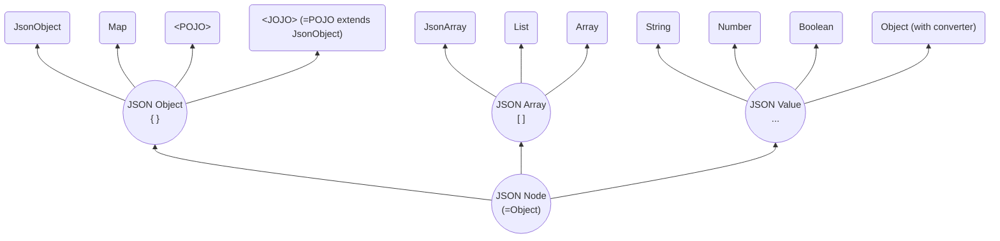

# SJF4J - Simple JSON Facade for Java

[](https://opensource.org/licenses/MIT)
[]()

## Overview

SJF4J (Simple JSON Facade for Java) serves as a simple facade for various JSON frameworks (e.g. Jackson, Gson, 
Fastjson2), and other JSON-like libraries (e.g. SnakeYAML).
It maps JSON-like data into an Object-Tree, and provides a unified, expressive, and powerful API for operating on this
tree. 

As shown in the Object-Tree node relationship diagram, each `JSON Object` node can be a type-safe `POJO`, 
or a dynamic `Map` or its wrapper `JsonObject`, or a hybrid type `JOJO` that combines the advantages of both 
`POJO` and `Map`. And `JSON Array` nodes follow the same design. It is the core feature of the Object-Tree model.


## User Manual

### Get it
`Gradle`:
```groovy
implementation("org.sjf4j:sjf4j:{version}")
```
SJF4J has no additional runtime dependencies.  
SJF4J includes built-in parsers for both `Object-Tree` and `Properties`.
If you want to work with `JSON` data, simply include Jackson, Gson, or Fastjson2, SJF4J will automatically select
the first available JSON parser in that order.
If you want to work with `YAML` data, just include SnakeYAML.

### Compatibility
   * JDK: requires JDK 8
   * Android: ???

### Basic Example

This example can be found at [...]
```java
    String json = "{\n" +
            "  \"id\": 1,\n" +
            "  \"name\": \"Alice\",\n" +
            "  \"active\": true,\n" +
            "  \"tags\": [\"java\", \"json\"],\n" +
            "  \"scores\": [95, 88.8, 0.5],\n" +
            "  \"user\": {\n" +
            "    \"role\": \"coder\",\n" +
            "    \"profile\": {\n" +
            "      \"level\": 7,\n" +
            "      \"values\": [1, \"two\", true, null, { \"x\": 3 }]\n" +
            "    }\n" +
            "  }\n" +
            "}";
    JsonObject jo = JsonObject.fromJson(json);          // from JSON to JsonObject
```

`JsonObject` is essentially a wrapper of `Map`. It provides Map-like operations, type-safe access, dynamic type casting, 
cross-type conversion, and a Builder-style chained API.

The basic: `get()`, `as()`, `put()`, `remove()`
```java
    Object nodeId = jo.getNode("id");
    // Retrieve the raw node as an Object without type conversion.

    Integer id = jo.getInteger("id");
    // Retrieve the node as a specific type (int) using `getXx(key)`.
    // Performs an internal cast/conversion if necessary.

    int id2 = jo.getInteger("id", 0);
    // Retrieve the node value with a default if the key is missing.

    String name = jo.get("name", String.class);
    // Retrieve the node with an explicit type parameter.
    // Ensures type-safe casting at runtime.

    String name1 = jo.get("name");
    // Dynamic type inference version of `get()`.
    // Type is inferred based on the context, convenient for shorthand usage.

    String active = jo.asString("active");
    // Retrieve and convert the node value across types using `asXxx(key)`.
    // Supports cross-type casting (e.g., Number → String).

    String active2 = jo.as("active");
    // Dynamic type conversion, short form of `asXxx()`.

    String role = jo.asJsonObject("user").get("role");
    // Chain operations for nested nodes.
    // First converts "user" node to JsonObject, then retrieves "role".

    jo.put("extra", "blabla");
    // Works like a Map: also supports `putIfAbsent()`, `putNonNull()`

    jo.toBuilder().putIfAbsent("x", "xx").put("y", "yy");
    // Supports Builder-style chained operations

    jo.remove("extra");
    // Also supports `removeIf()`, `forEach()` etc.
```

Path-based operations include `getByPath()`, `asByPath()`, `putByPath()`, and `removeByPath()`, 
supporting the full `JSON Path` (except Filter expressions) and `JSON Pointer` syntax.
```java
    String role2 = jo.getStringByPath("$.user.role");         
    // `getXxByPath()` supports JSON Path expressions
    
    String role3 = jo.getByPath("/user/role");                
    // And JSON Pointer as an alternative
    
    String role4 = jo.asByPath("$..role");                    
    // Supports descendant operator for deep traversal
    
    jo.putByPath("/aa/bb", "cc");                             
    // Automatically creates intermediate nodes! e.g., {"aa":{"bb":"cc"},..}
    
    jo.putNonNullByPath("$.scores[3]", 100);                  
    // Supports array index insertion
    
    List<String> tags = jo.findAll("$.tags[*]", String.class);          
    // Supports Wildcard '.*' or '[*]', `findAll()` return a list of nodes
    
    List<Short> scores = jo.findAllAs("$.scores[0:3]", Short.class);    
    // Supports Slice '[from:to:step]'
    
    List<Object> unions = jo.findAllNodes("$.user['role','profile']");  
    // Supports Union '[A,B,..]' of multiple fields
```
Advanced traversal with `walk()`, `stream()` 
```java
    jo.walk(Target.CONTAINER, Order.BOTTOM_UP, (path, node) -> {
        // Target: CONTAINER or VALUE
        // Order: BOTTOM_UP (leaf-to-root) or TOP_DOWN (root-to-leaf)
        System.out.println("path=" + path + ", node=" + node);
        return Control.CONTINUE; // CONTINUE to proceed, or STOP if needed
    });

    List<String> tags2 = jo.stream()    // Follows Java Stream syntax
            .findAll("$.tags[*]", String.class)
            .filter(tag -> tag.length() > 3)    // More powerful than JSON Path Filter
            .toList();
    
    int x = jo.stream()
            .findAllAs("$..profile", JsonObject.class)
            .filter(n -> n.hasNonNull("values"))    // Only nodes containing the 'values' key
            .findAs("$..x", Integer.class)      // Secondary search within the filtered nodes
            .findFirst()    // Return the first element (JDK Stream)
            .orElse(4);
    
    double avgScore = jo.stream()
            .findAll("$.scores[*]", Double.class)
            .filter(Double::isFinite)
            .collect(Collectors.averagingDouble(s -> s));   // Compute average using `java.util.Collectors`
```

### Advanced Example

先给出 `POJO` 和 `JOJO` (即：一个继承了JsonObject的POJO) 示例。
```java
    // POJO example
    class User {
        int id;
        String name;
        List<User> friends;
    }

    // JOJO example (POJO with dynamic JsonObject capabilities)
    class User2 extends JsonObject {
        int id;
        String name;
        List<User2> friends;
    }

    String json = "{\n" +
            "  \"id\": 1,\n" +
            "  \"name\": \"Alice\",\n" +
            "  \"friends\": [\n" +
            "    { \"id\": 2, \"name\": \"Bill\", \"active\": true },\n" +
            "    {\n" +
            "      \"id\": 3,\n" +
            "      \"name\": \"Cindy\",\n" +
            "      \"friends\": [\n" +
            "        {\"id\": 4, \"name\": \"Dino\"},\n" +
            "        {\"id\": 5, \"info\": \"bla bla\"}\n" +
            "      ]\n" +
            "    }\n" +
            "  ],\n" +
            "  \"age\": 18\n" +
            "}\n";
```

Converting between JSON Input and `JsonObject` / `Map` / `POJO` / `JOJO`.
```java
    JsonObject jo = Sjf4j.fromJson(json);                   // = JsonObject.fromJson(json), to JsonObject
    Map<String, Object> map = Sjf4j.fromJson(json, new TypeReference<Map<String, Object>>() {});    // to Map
    User user = Sjf4j.fromJson(json, User.class);           // to User.class which is a `POJO`
    User2 user2 = Sjf4j.fromJson(json, User2.class);        // to User2.class which is a `JOJO`

    // Serialize back to JSON
    System.out.println("jo=" + jo.toJson());    // Equivalent to JsonObject.fromJson(json)
    System.out.println("map=" + Sjf4j.toJson(map));         // Map representation
    System.out.println("user=" + Sjf4j.toJson(user));   // Only outputs fields defined in User
    System.out.println("user2=" + user2.toJson());      // Outputs both fixed User2 fields and dynamic JsonObject nodes

    // Convert JSON to YAML
    jo = Sjf4j.fromYaml(jo.toYaml());                       // YAML format is equivalent to JSON

    // Convert Properties to JsonObject
    Properties props = new Properties();
    props.load(new StringReader("aa.bb[0].cc=dd"));
```

Converting between `JsonObject` and `Map` / `POJO` / `JOJO`.
```java
    // JsonObject <==> Map
    Map<String, Object> tmpMap = jo.toMap();
    tmpJo = new JsonObject(map);

    // JsonObject <==> POJO/JOJO
    User tmpUser = jo.toPojo(User.class);                   // = Sjf4j.fromPojo(jo, User.class)
    tmpJo = Sjf4j.fromPojo(user2);
```
`JOJO` inherits all the methods of `JsonObject`, while also providing native `POJO` `getters` and `setters`
```java
    System.out.println("keys=" + user2.keySet());       // ["id", "name", "friends", "age"]
    System.out.println("name=" + user2.getString("name"));  // Equivalent to user2.getName()
    user2.put("name", "Jenny");                         // Equivalent to user2.setName("Jenny")
    int allUsers = user2.findAllNodes("$..id").size();  // Count all nodes with key "id" using JSON Path
```