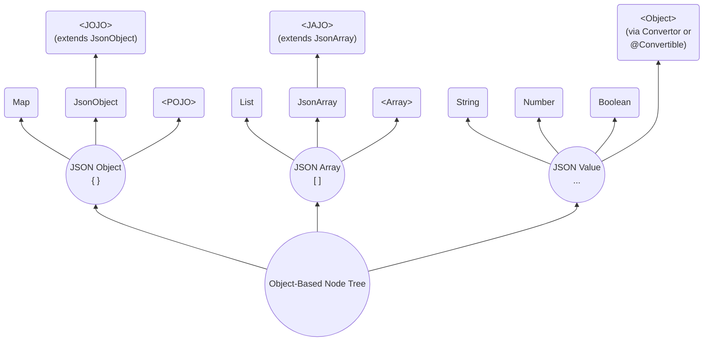

# SJF4J - Simple JSON Facade for Java

[](https://opensource.org/licenses/MIT)
[]()

## Overview

**SJF4J (Simple JSON Facade for Java)** is a lightweight facade over multiple JSON parsers
(e.g. Jackson, Gson, Fastjson2) as well as other JSON-like data parsers (e.g. SnakeYAML, Java Properties).

SJF4J maps structured data into an **Object-Based Node Tree** and exposes a unified, expressive API
for navigating, querying, validating, and mutating that tree. 
Its design follows the core data model and semantics defined by published JSON RFCs 
as well as relevant draft specifications.

> Unlike traditional JSON libraries that rely on dedicated AST node hierarchies,
> **all nodes in SJF4J are represented as native Java objects**, allowing seamless integration with existing Java code, type systems, and frameworks.



#### JSON Object (`{}`)
- **`Map`**  
A generic key-value representation using standard Java `Map`.
- **`JsonObject`**  
A lightweight wrapper around a map structure that provides JSON-oriented APIs,
and can also wrap POJO fields via getter/setter access when backed by a subclass.
- **`<POJO>`(Plain Old Java Object)**  
A strongly typed Java object with fields, getters, and setters.
- **`<JOJO>`(JSON Object Java Object)**   
A hybrid object that extends `JsonObject` while also behaving like a typed Java object,
combining the flexibility of dynamic JSON access with the safety and expressiveness of `POJOs`.

#### JSON Array (`[]`)
- `List`  
A standard Java `List` used as a direct representation of a JSON array.
- `JsonArray`  
A structured wrapper around a JSON array that provides a rich, JSON-aware API.
- `<Array>`  
A native Java array (e.g. `Object[]`, `String[]`, `int[]`) used when a fixed-size, 
strongly typed representation is desired.
- **`<JAJO>` (JSON Array Java Object)**  
  An array type extending `JsonArray`. It is a first-class Java object that strictly represents a JSON Array  
  (never a JSON Object), and is suitable for domain-specific array models (e.g. `JsonPatch`).

#### JSON Value (`..`)
- `String`  Represents JSON `string` values.
- `Number`  Represents JSON `numeric` values, including integers and floating-point numbers.
- `Boolean` Represents JSON boolean values (`true` and `false`).
- `Null`    Represents the JSON `null` literal.
- `<Object>`:  
SJF4J allows JSON values to be **converted into arbitrary Java objects** through a pluggable conversion mechanism 
(via `Converter` or `@Convertible`), enabling seamless integration with **domain-specific types** (e.g. `LocalDate`).

## Getting Started

### Installation

SJF4J requires only `JDK 8` and has no external dependencies.

`Gradle`:
```groovy
implementation("org.sjf4j:sjf4j:{version}")
```

To handle ***JSON*** data, you need to add `Jackson`, `Gson`, or `Fastjson2` to your classpath. 
The first available parser in this order will be automatically used. 
If none of them are detected, SJF4J will fall back to its own simple (and slower) JSON parser.

To handle ***YAML*** data, simply include `SnakeYAML`.

To handle ***Java Properties***, there is a built-in parser.
Note that conversion from `java.util.Properties` is limited by its format restrictions. 

In ***No-Data*** scenarios, SJF4J can also ***be used without parsing any external data***.
It operates directly on in-memory object graphs via the Object-Based Node Tree,
providing the same JSON-oriented APIs.

### Starting from `JsonObject`
`JsonObject` is the primary entry point for interacting with JSON-style object nodes, so we start from it.  
Its methods follow JSON semantics, for example, `hasNonNull()` for not `null` vs `containsKey()` for missing.

- `getNode(key)`  
Returns the raw underlying node as an `Object`, without any type conversion or adaptation.
- `get(key, type)` / `getString(key)`/ `getLong(key)` ...  
Performs in-type access with minimal adaptation when required (e.g. `Double` → `Float`, `Integer` → `Long`).
- `as(key, type)` / `asString(key)` / `asLong(key)` ...  
Performs cross-type conversion, including semantic conversions (e.g. `String` → `Number`, `Boolean` → `String`).
Useful for schema-less data handling.
- `put(key, value)` / `putIfAbsent(key, value)` / `remove(key)` ...  
Inserts, replaces, or removes.
- `builder()` / `toBuilder().put(..).put(..)`  
Supports builder-style chained operations.

Full codes are available at
[SimpleExample](https://github.com/sjf4j-projects/sjf4j/blob/main/sjf4j/src/test/java/org/sjf4j/SimpleExample.java).

```java
    String json = "{\n" +
            "  \"id\": 1,\n" +
            "  \"name\": \"Alice\",\n" +
            "  \"active\": true,\n" +
            "  \"tags\": [\"java\", \"json\"],\n" +
            "  \"scores\": [95, 88.8, 0.5],\n" +
            "  \"user\": {\n" +
            "    \"role\": \"coder\",\n" +
            "    \"profile\": {\n" +
            "      \"level\": 7,\n" +
            "      \"values\": [1, \"two\", true, null, { \"x\": 3 }]\n" +
            "    }\n" +
            "  }\n" +
            "}";

    JsonObject jo = JsonObject.fromJson(json);  
    // Parse JSON string to JsonObject

    Object node = jo.getNode("id");
    // Retrieve the raw node as an Object without type conversion.
    // Return null if the key is missing.

    Integer id = jo.getInteger("id");
    // Retrieve the node as a specific type using getXxx(key).
    // Performs numeric conversion within the Number hierarchy if necessary.

    double id2 = jo.getDouble("id", 0d);
    // Returns the node value, or the default if the property is null or missing.

    String name = jo.get("name", String.class);
    // Retrieve the node with an explicit type parameter.
    // Ensures type-safe casting at runtime.

    String name1 = jo.get("name");
    // Dynamic type inference version of `get()`.
    // Type is inferred based on the context, convenient for shorthand usage.

    String active = jo.asString("active");
    // Retrieve and convert the node value across types using `asXxx(key)`.
    // Supports cross-type casting (e.g., Number → String).

    String active2 = jo.as("active");
    // Dynamic type conversion, short form of `as(key, type)`.

    String role = jo.asJsonObject("user").get("role");
    // Chain operations for nested nodes.
    // First converts "user" node to JsonObject, then retrieves "role".

    jo.put("extra", "blabla");
    // See also: `putNonNull()`, `putIfAbsent()`, `computeIfAbsent()`

    jo.toBuilder().putIfAbsent("x", "xx").put("y", "yy");
    // Provides Builder-style chained operations.

    jo.remove("extra");
    // See also: `removeIf()`, `forEach()` etc.
```

> `JsonArray` represents JSON-style array nodes.
> It follows the same API philosophy as `JsonObject`, including JSON-semantic access, mutation, and type conversion, 
> but applies them to ordered array elements rather than object properties.

### Path-based Operating with `JsonPath`/`JsonPointer`

The path syntax supports the **full** [JSON Path](https://datatracker.ietf.org/doc/html/draft-ietf-jsonpath-base)
/ [JSON Pointer](https://datatracker.ietf.org/doc/html/rfc6901) specifications.  

**JSON Path Syntax**

| Syntax                                 | Description                                               | Example                  |
|----------------------------------------|-----------------------------------------------------------|--------------------------|
| `$`                                    | Root object                                               | `$`                      |
| `@`                                    | Current node (Filter context only)                        | `@.name`                 |
| `.name`, `['name']`                    | Object member name                                        | `$['store'].book`        |
| `[index]`                              | Array index (0-based; negative values index from the end) | `$.store['book'][0]`     |
| `..`                                   | Recursive descent (object or array)                       | `$..author`              |
| `.*`, `[*]`                            | Wildcard (all children)                                   | `$.store[*]`             |
| `[start:end]`, `[start:end:step]`      | Array slice (end exclusive)                               | `$.*.book[1:3]`          |
| `[index1,index2]`, `['name1','name2']` | Union of array indices or object members                  | `$.store.book[0, -1]`    |
| `[?(<filter>)]`                        | Filter expression                                         | `$..book[?@.price < 10]` |
| `func()`                               | Function call at the end of a path or in a filter         | `$..book.size()`         |


**Filter Expressions**

| Syntax                  | Description                    | Example                                                    |
|-------------------------|--------------------------------|------------------------------------------------------------|
| `@`, `$`                | Path expression                | `$.orders[?(@.amount > $.config.minAmount)]`               |
| `==`, `!=`              | Equality / inequality          | `@.category == 'fiction'`                                  |
| `<`, `<=`, `>`, `>=`    | Numeric comparison             | `@.price >= 20`                                            |
| `&&`, `\|\|`, `!`, `()` | Logical operators and grouping | `@.author != null \|\| ($..book.length() < 10 && !@.isbn)` |
| `=~`                    | Full regular expression match  | `@.author =~ /.*lice/i`                                    |

**Functions**

| Syntax                                         | Description                                                                                                             | Example                           |
|------------------------------------------------|-------------------------------------------------------------------------------------------------------------------------|-----------------------------------|
| `length()`                                     | Returns the length of a string, array, or object                                                                        | `$[?length(@.authors) >= 5]`      |
| `count()`                                      | Returns the number of nodes in a nodelist                                                                               | `$[?count(@.*.author) >= 5]`      |
| `match()`                                      | Tests whether a string matches a given [I-Regexp](https://datatracker.ietf.org/doc/html/draft-ietf-jsonpath-iregexp-08) | `$[?match(@.date, "1974-05-..")]` |
| `search()`                                     | Tests whether a string contains a substring that `match()`                                                              | `$[?search(@.author, "[BR]ob")]`  |
| `value()`                                      | Convert an instance of NodesType to a value                                                                             | `$[?value(@..color) == "red"]`    |
| `sum()`, `min()`, `max()`, `avg()`, `stddev()` | Numeric aggregation functions                                                                                           | `$[?sum(@.price) < 20]`           |
| `first()`, `last()`, `index()`                 | Returns the first, last, or indexed element of an array                                                                 | `$[?first(@.title) =~ /^J/]`      |

> **Extensibility**: Use `FunctionRegistry.register()` to add your own functions and extend JSON Path with custom logic.

**JSON Pointer Syntax**

| Syntax  | Description              | Example         |
|---------|--------------------------|-----------------|
| `/`     | Root separator           | `/` (root)      |
| `/name` | Object member access     | `/store/book`   |
| `/0`    | Array index (0-based)    | `/store/book/0` |
| `~0`    | Escape for `~` character | `/a~0b`         |
| `~1`    | Escape for `/` character | `/a~1b`         |

**Note**: JSON Pointer paths always start with `/`, 
and only direct navigation is supported; no wildcards or filters.


### Diffing and Merging with `JsonPatch`

### Validating with `JsonSchema`

TODO

### Modeling Domain Objects with `<JOJO>`/`<JAJO>`

### Converting Between JSON-like Data and Java Objects

```java
    Object role2 = jo.getNodeByPath("$.user.role");         
    // `getXxByPath()` supports JSON Path expressions
    
    String role3 = jo.getByPath("/user/role");                
    // And JSON Pointer as an alternative
    
    String role4 = jo.asByPath("$..role");                    
    // Supports descendant operator for deep traversal

    String role5 = JsonPath.compile("$.user.role").getString(jo);
    // `JsonPath.compile(expr)` 

    List<String> tags = jo.findByPath("$.tags[*]", String.class);          
    // Supports Wildcard '.*' or '[*]', `find()` return a list of nodes
    
    List<Short> scores = jo.findAsByPath("$.scores[0:3]", Short.class);    
    // Supports Slice '[from:to:step]'
    
    List<Object> unions = jo.findNodesByPath("$.user['role','profile']");  
    // Supports Union '[A,B,..]' of multiple fields
    
    jo.putByPath("/aa/bb", "cc");
    // Automatically creates intermediate nodes!! e.g., {"aa":{"bb":"cc"},..}
    
    jo.putNonNullByPath("$.scores[3]", 100);
    // Supports array index insertion

    int count = jo.evalByPath("$.scores.count()", int.class);
    // Supports Function at the end.
    // 

```
Additionally, the traversal APIs `walk()` and `stream()` provide powerful ways to programmatically navigate and 
inspect the Object-Tree.
```java
    jo.walk(Target.CONTAINER, Order.BOTTOM_UP, (path, node) -> {
        // Target: CONTAINER or VALUE
        // Order: BOTTOM_UP (leaf-to-root) or TOP_DOWN (root-to-leaf)
        System.out.println("path=" + path + ", node=" + node);
        return Control.CONTINUE; // CONTINUE to proceed, or STOP if needed
    });

    List<String> tags2 = jo.stream()                    // Follows Java Stream syntax
            .findAll("$.tags[*]", String.class)
            .filter(tag -> tag.length() > 3)            // Filter using Java codes
            .toList();
    
    int x = jo.stream()
            .findAllAs("$..profile", JsonObject.class)  // Primary find all
            .filter(n -> n.hasNonNull("values")) 
            .findAs("$..x", Integer.class)              // Secondary find one
            .findFirst()
            .orElse(4);
    
    double avgScore = jo.stream()
            .findAll("$.scores[*]", Double.class)
            .map(d -> d < 60 ? 60 : d)                  // No one failed!
            .collect(Collectors.averagingDouble(s -> s));
```

---
### Example with POJO / JOJO

Definitions:
 * **Map**: The standard Java container for dynamic elements. Flexible, but cannot provide compile-time checking 
like a `POJO`.
 * **JsonObject**: A wrapper of `Map` that provides many additional APIs for convenient Object-Tree operations.
 * **POJO**: Plain Old Java Object. `POJO` offers the highest performance and type safety, but its `fields` 
are fixed and must be defined at compile time. This is a key factor limiting development efficiency.
 * **JOJO**: JSON-Oriented Java Object. Any subclass of `JsonObject` is automatically a `JOJO`.
So a `POJO` can become a `JOJO` simply by extending `JsonObject`. 

```java
    // POJO example
    class User {
        int id;
        String name;
        List<User> friends;
    }

    // JOJO example
    class User2 extends JsonObject {
        int id;
        String name;
        List<User2> friends;
    }

    String json = "{\n" +
            "  \"id\": 1,\n" +
            "  \"name\": \"Alice\",\n" +
            "  \"friends\": [\n" +
            "    { \"id\": 2, \"name\": \"Bill\", \"active\": true },\n" +
            "    {\n" +
            "      \"id\": 3,\n" +
            "      \"name\": \"Cindy\",\n" +
            "      \"friends\": [\n" +
            "        {\"id\": 4, \"name\": \"Dino\"},\n" +
            "        {\"id\": 5, \"info\": \"bla bla\"}\n" +
            "      ]\n" +
            "    }\n" +
            "  ],\n" +
            "  \"age\": 18\n" +
            "}\n";
```

Converting between data `Input` and `JsonObject` / `Map` / `POJO` / `JOJO`.
```java
    JsonObject jo = Sjf4j.fromJson(json);               // = JsonObject.fromJson(json), to JsonObject
    Map<String, Object> map = Sjf4j.fromJson(json,      // to Map
            new TypeReference<Map<String, Object>>() {});    
    User user = Sjf4j.fromJson(json, User.class);       // to POJO
    User2 user2 = Sjf4j.fromJson(json, User2.class);    // to JOJO

    // Serialize back to JSON
    System.out.println("jo=" + jo.toJson());            // = Sjf4j.toJson(jo)
    System.out.println("map=" + Sjf4j.toJson(map));     // Output dynamic nodes in Map
    System.out.println("user=" + Sjf4j.toJson(user));   // Only outputs fields defined in User
    System.out.println("user2=" + user2.toJson());
    // Outputs both fixed fields in User2 and dynamic nodes in super JsonObject

    // YAML is handled the same way as JSON
    jo = JsonObject.fromYaml(jo.toYaml());

    // Limited conversion to/from Properties:
    jo.toProperties(System.getProperties());    // {"aa":{"bb":[{"cc":"dd"}]}} => aa.bb[0].cc=dd                
    
```

Converting between `JsonObject`, `Map`, `POJO`, and `JOJO`.
```java
    // JsonObject <==> Map
    Map<String, Object> tmpMap = jo.toMap();
    tmpJo = new JsonObject(map);    // Just wrap it

    // JsonObject <==> POJO/JOJO
    User tmpUser = jo.toPojo(User.class);
    tmpJo = Sjf4j.fromPojo(user2);
    
    // JOJO <==> POJO
    tmpUser = user2.toPojo(User.class);
    User2 tmpUser2 = Sjf4j.fromPojo(user, User2.class);
```
`JOJO` inherits all APIs from super class `JsonObject`, and also has `Getters` / `Setters` of `POJO`.
They are fully equivalent.

> **Key point**: `JOJO` combines the **type-safe, high-performance nature** of `POJOs` with
> the **dynamic flexibility** of `Maps`.  
It may enable a script-like Java development experience and is highly recommended.

```java
    System.out.println("keys=" + user2.keySet());
    // ["id",  "name",  "friends",  "age"]
    //   └────────┼─────────┘         │
    //            ↓                   ↓
    //      Fields in POJO       Property in JsonObject
        
    System.out.println("name=" + user2.getName());
    // = user2.getString("name"));

    user2.put("name", "Jenny");
    // = user2.setName("Jenny")

    String bill = user2.getFriends().get(0).getName();
    // = user2.getStringByPath("$.friends[0].name")

    int allUsers = user2.findAllNodes("$..id").size();
    // Use advanced APIs provided by JsonObject
```

---
### Starting from Scratch

**1. Early Stage: Use `JsonObject` or an Empty `JOJO`***  
At the beginning, you can simply use `JsonObject`, or define an empty `JOJO` class:
```java
// Empty JOJO
public class Person extends JsonObject {
    // Nothing here
}
```
An empty `JOJO` is equivalent to a plain `JsonObject`:
it can store any JSON-like structure without loss and without predefined fields.

**2. Scaling Up: Two Upgrade Paths**  
As your project grows, you may want stronger structure, type safety, or better performance.
There are two upgrade paths:

 - **Path A — Evolve Toward a POJO**

Gradually “solidify” frequently used properties into strongly typed POJO fields.
This improves performance and enables static type checking while keeping flexibility for other fields.
```java
@Getter @Setter
public class Person extends JsonObject {
    private String name;    // Solidified as a field for the best performance
    private int age;

    // All other properties continue to exist inside JsonObject storage
}
```
This hybrid design allows you to ***transition from dynamic to static structure*** without losing compatibility.

 - **Path B — Use @Jojo Annotatio to codegen** (Not Yet Implemented - -! )

You can annotate a class with `@Jojo` to automatically generate `Getters` / `Setters`
(and possibly other convenience methods).
```java
@Jojo({
        @Property(name = "name", type = String.class),
        @Property(name = "age", type = int.class, comment = "by years")
})
public class Person extends JsonObject {
    
}
```
Internally it is still Map-based, but with compile-time validation and `IDE` support.

> Code generation is not yet implemented. Contributions are very welcome! 🙏

---
### From an Existing Project

**1. If your project currently uses a dynamic map-like type**  
(e.g., `Map/List`, `ObjectNode` in Jackson, `JsonObject` in Gson, `JSONObject` in Fastjson2):

You may switch to **SJF4J’s** `JsonObject` if you want:
- unified API across libraries
- path-based and more convenient operations
- interoperability with POJO / JOJO
- JSON / YAML / Properties conversion

**2. If your project already uses POJOs**  
There are two scenarios:

 1. Your POJO ***can*** extend `JsonObject`  

If inheritance is allowed, simply let your POJO extend `JsonObject`.  
You keep all existing fields and methods, while gaining full SJF4J capabilities.

 2. Your POJO ***cannot*** extend `JsonObject`  
(e.g., Java Record, ProtoBuf Message, classes from external libraries)

Then you must use ***copy-based wrapping***:
```java
    JsonObject jo = new JsonObject(myPojo);     // Shallow copy
    ...
    myPojo = jo.toPojo(Person.class);           // Copy back to POJO
```

In the future, annotation-based code generation may offer POJO-style accessors like this:
```java
@Jojo(target = Person.class)
public class PersonJo extends JsonObject {

}
```

## Contributing

SJF4J is built to *make Java Development more enjoyable*.  
Feel free to [open an issue](https://github.com/sjf4j-projects/sjf4j/issues/new) for questions, bugs, ideas,
or simply to say hi — your interest already means a lot to the project.  
Contributions of all kinds, whether it’s code, documentation, examples, benchmarking, or simply filing an issue, 
are truly appreciated! ❤️

## License

SJF4J is licensed under the [MIT License](https://opensource.org/licenses/MIT).  
Free to use, modify, and distribute this project in both open-source and commercial applications, 
with minimal restrictions.


