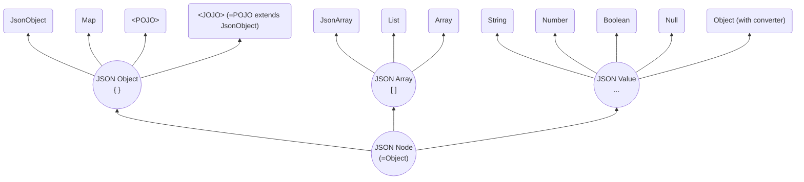

# SJF4J - Simple JSON Facade for Java

[](https://opensource.org/licenses/MIT)
[]()

## Overview

**SJF4J (Simple JSON Facade for Java)** serves as a simple facade for various JSON frameworks (e.g. Jackson, Gson, 
Fastjson2), and other JSON-like libraries (e.g. SnakeYAML).
It maps JSON-like data into an Object-Tree, and provides a unified, expressive, and powerful API for operating on this
tree. 

As shown in the **Object-Tree** node relationship diagram, each `JSON Object` node can be a type-safe `POJO`, 
or a dynamic `Map` (or its wrapper `JsonObject`), or a hybrid type `JOJO` that combines the advantages of both 
`POJO` and `Map`. The same design applies to `JSON Array` nodes as well.  
This flexible representation is the core feature of the Object-Tree model.


## Getting Started

### Get it

`Gradle`:
```groovy
implementation("org.sjf4j:sjf4j:{version}")
```
SJF4J requires only `JDK 8` and has no external dependencies.

To handle ***JSON*** data, you need to add `Jackson`, `Gson`, or `Fastjson2` to your classpath. 
The first available parser in this order will be automatically used. 
If none of them are detected, SJF4J will fall back to its own simple (and slower) JSON parser.

To handle ***YAML*** data, simply include `SnakeYAML`.

To handle ***Properties***, there is a built-in parser. 
Note that conversion from `java.util.Properties` is limited by the inherent restrictions of the Properties format. 

To work with ***POJOs***, SJF4J also provides built-in support for ***Object-Tree***, 
so even if you do not process any JSON/YAML data and work only with POJOs, you can still use SJF4J effectively.

### Basic Example

Full codes are available at 
[SimpleExample](https://github.com/sjf4j-projects/sjf4j/blob/main/sjf4j/src/test/java/org/sjf4j/SimpleExample.java).

> `JsonObject` is essentially a wrapper of `Map`. 
> It provides map-like operations, type-safe access, dynamic type casting, 
> cross-type conversion, builder-style chaining, path-based operations, and other expressive APIs.
```java
    String json = "{\n" +
            "  \"id\": 1,\n" +
            "  \"name\": \"Alice\",\n" +
            "  \"active\": true,\n" +
            "  \"tags\": [\"java\", \"json\"],\n" +
            "  \"scores\": [95, 88.8, 0.5],\n" +
            "  \"user\": {\n" +
            "    \"role\": \"coder\",\n" +
            "    \"profile\": {\n" +
            "      \"level\": 7,\n" +
            "      \"values\": [1, \"two\", true, null, { \"x\": 3 }]\n" +
            "    }\n" +
            "  }\n" +
            "}";

    JsonObject jo = JsonObject.fromJson(json);  // Parse JSON string to JsonObject
```

Firstly, the basic operations include: `get()`, `as()`, `put()` and `remove()`. 
 * The `get()` will automatically perform an in-type cast (e.g., Double → Float) if necessary.
 * The `as()` is more aggressive, supporting cross-type conversion (e.g., String → Number).
```java
    Object nodeId = jo.getNode("id");
    // Retrieve the raw node as an Object without type conversion.

    Integer id = jo.getInteger("id");
    // Retrieve the node as a specific type (int) using `getXx(key)`.
    // Performs an internal cast/conversion if necessary.

    int id2 = jo.getInteger("id", 0);
    // Retrieve the node value with a default if the key is missing.

    String name = jo.get("name", String.class);
    // Retrieve the node with an explicit type parameter.
    // Ensures type-safe casting at runtime.

    String name1 = jo.get("name");
    // Dynamic type inference version of `get()`.
    // Type is inferred based on the context, convenient for shorthand usage.

    String active = jo.asString("active");
    // Retrieve and convert the node value across types using `asXxx(key)`.
    // Supports cross-type casting (e.g., Number → String).

    String active2 = jo.as("active");
    // Dynamic type conversion, short form of `asXxx()`.

    String role = jo.asJsonObject("user").get("role");
    // Chain operations for nested nodes.
    // First converts "user" node to JsonObject, then retrieves "role".

    jo.put("extra", "blabla");
    // See also: `putNonNull()`, `putIfAbsent()`, `computeIfAbsent()`

    jo.toBuilder().putIfAbsent("x", "xx").put("y", "yy");
    // Supports Builder-style chained operations

    jo.remove("extra");
    // See also: `removeIf()`, `forEach()`, `merge()` etc.
```

Secondly, the path-based operations include: `getByPath()`, `asByPath()`, `putByPath()`, and `removeByPath()`.

 * The path syntax supports the full (except Filter or Function yet)
 [JSON Path](https://datatracker.ietf.org/doc/html/draft-ietf-jsonpath-base) 
 and [JSON Pointer](https://datatracker.ietf.org/doc/html/rfc6901).

> **Highlighting**: `putByPath()` / `computeIfAbsentByPath()` /.. can automatically create intermediate nodes,
>  which is extremely useful in practice.

```java
    String role2 = jo.getStringByPath("$.user.role");         
    // `getXxByPath()` supports JSON Path expressions
    
    String role3 = jo.getByPath("/user/role");                
    // And JSON Pointer as an alternative
    
    String role4 = jo.asByPath("$..role");                    
    // Supports descendant operator for deep traversal
    
    jo.putByPath("/aa/bb", "cc");                             
    // Automatically creates intermediate nodes!! e.g., {"aa":{"bb":"cc"},..}
    
    jo.putNonNullByPath("$.scores[3]", 100);                  
    // Supports array index insertion
    
    List<String> tags = jo.findAll("$.tags[*]", String.class);          
    // Supports Wildcard '.*' or '[*]', `findAll()` return a list of nodes
    
    List<Short> scores = jo.findAllAs("$.scores[0:3]", Short.class);    
    // Supports Slice '[from:to:step]'
    
    List<Object> unions = jo.findAllNodes("$.user['role','profile']");  
    // Supports Union '[A,B,..]' of multiple fields
```
Additionally, the traversal APIs `walk()` and `stream()` provide powerful ways to programmatically navigate and 
inspect the Object-Tree.
```java
    jo.walk(Target.CONTAINER, Order.BOTTOM_UP, (path, node) -> {
        // Target: CONTAINER or VALUE
        // Order: BOTTOM_UP (leaf-to-root) or TOP_DOWN (root-to-leaf)
        System.out.println("path=" + path + ", node=" + node);
        return Control.CONTINUE; // CONTINUE to proceed, or STOP if needed
    });

    List<String> tags2 = jo.stream()                    // Follows Java Stream syntax
            .findAll("$.tags[*]", String.class)
            .filter(tag -> tag.length() > 3)            // Filter using Java codes
            .toList();
    
    int x = jo.stream()
            .findAllAs("$..profile", JsonObject.class)  // Primary find all
            .filter(n -> n.hasNonNull("values")) 
            .findAs("$..x", Integer.class)              // Secondary find one
            .findFirst()
            .orElse(4);
    
    double avgScore = jo.stream()
            .findAll("$.scores[*]", Double.class)
            .map(d -> d < 60 ? 60 : d)                  // No one failed!
            .collect(Collectors.averagingDouble(s -> s));
```

---
### Example with POJO / JOJO

Definitions:
 * **Map**: The standard Java container for dynamic elements. Flexible, but cannot provide compile-time checking 
like a `POJO`.
 * **JsonObject**: A wrapper of `Map` that provides many additional APIs for convenient Object-Tree operations.
 * **POJO**: Plain Old Java Object. `POJO` offers the highest performance and type safety, but its `fields` 
are fixed and must be defined at compile time. This is a key factor limiting development efficiency.
 * **JOJO**: JSON-Oriented Java Object. Any subclass of `JsonObject` is automatically a `JOJO`.
So a `POJO` can become a `JOJO` simply by extending `JsonObject`. 

```java
    // POJO example
    class User {
        int id;
        String name;
        List<User> friends;
    }

    // JOJO example
    class User2 extends JsonObject {
        int id;
        String name;
        List<User2> friends;
    }

    String json = "{\n" +
            "  \"id\": 1,\n" +
            "  \"name\": \"Alice\",\n" +
            "  \"friends\": [\n" +
            "    { \"id\": 2, \"name\": \"Bill\", \"active\": true },\n" +
            "    {\n" +
            "      \"id\": 3,\n" +
            "      \"name\": \"Cindy\",\n" +
            "      \"friends\": [\n" +
            "        {\"id\": 4, \"name\": \"Dino\"},\n" +
            "        {\"id\": 5, \"info\": \"bla bla\"}\n" +
            "      ]\n" +
            "    }\n" +
            "  ],\n" +
            "  \"age\": 18\n" +
            "}\n";
```

Converting between data `Input` and `JsonObject` / `Map` / `POJO` / `JOJO`.
```java
    JsonObject jo = Sjf4j.fromJson(json);               // = JsonObject.fromJson(json), to JsonObject
    Map<String, Object> map = Sjf4j.fromJson(json,      // to Map
            new TypeReference<Map<String, Object>>() {});    
    User user = Sjf4j.fromJson(json, User.class);       // to POJO
    User2 user2 = Sjf4j.fromJson(json, User2.class);    // to JOJO

    // Serialize back to JSON
    System.out.println("jo=" + jo.toJson());            // = Sjf4j.toJson(jo)
    System.out.println("map=" + Sjf4j.toJson(map));     // Output dynamic nodes in Map
    System.out.println("user=" + Sjf4j.toJson(user));   // Only outputs fields defined in User
    System.out.println("user2=" + user2.toJson());
    // Outputs both fixed fields in User2 and dynamic nodes in super JsonObject

    // YAML is handled the same way as JSON
    jo = JsonObject.fromYaml(jo.toYaml());

    // Limited conversion to/from Properties:
    jo.toProperties(System.getProperties());    // {"aa":{"bb":[{"cc":"dd"}]}} => aa.bb[0].cc=dd                
    
```

Converting between `JsonObject`, `Map`, `POJO`, and `JOJO`.
```java
    // JsonObject <==> Map
    Map<String, Object> tmpMap = jo.toMap();
    tmpJo = new JsonObject(map);    // Just wrap it

    // JsonObject <==> POJO/JOJO
    User tmpUser = jo.toPojo(User.class);
    tmpJo = Sjf4j.fromPojo(user2);
    
    // JOJO <==> POJO
    tmpUser = user2.toPojo(User.class);
    User2 tmpUser2 = Sjf4j.fromPojo(user, User2.class);
```
`JOJO` inherits all APIs from super class `JsonObject`, and also has `Getters` / `Setters` of `POJO`.
They are fully equivalent.

> **Key point**: `JOJO` combines the **type-safe, high-performance nature** of `POJOs` with
> the **dynamic flexibility** of `Maps`.  
It may enable a script-like Java development experience and is highly recommended.

```java
    System.out.println("keys=" + user2.keySet());
    // ["id",  "name",  "friends",  "age"]
    //   └────────┼─────────┘         │
    //            ↓                   ↓
    //      Fields in POJO       Property in JsonObject
        
    System.out.println("name=" + user2.getName());
    // = user2.getString("name"));

    user2.put("name", "Jenny");
    // = user2.setName("Jenny")

    String bill = user2.getFriends().get(0).getName();
    // = user2.getStringByPath("$.friends[0].name")

    int allUsers = user2.findAllNodes("$..id").size();
    // Use advanced APIs provided by JsonObject
```

---
### Starting from Scratch

**1. Early Stage: Use `JsonObject` or an Empty `JOJO`***  
At the beginning, you can simply use `JsonObject`, or define an empty `JOJO` class:
```java
// Empty JOJO
public class Person extends JsonObject {
    // Nothing here
}
```
An empty `JOJO` is equivalent to a plain `JsonObject`:
it can store any JSON-like structure without loss and without predefined fields.

**2. Scaling Up: Two Upgrade Paths**  
As your project grows, you may want stronger structure, type safety, or better performance.
There are two upgrade paths:

 - **Path A — Evolve Toward a POJO**

Gradually “solidify” frequently used properties into strongly typed POJO fields.
This improves performance and enables static type checking while keeping flexibility for other fields.
```java
@Getter @Setter
public class Person extends JsonObject {
    private String name;    // Solidified as a field for the best performance
    private int age;

    // All other properties continue to exist inside JsonObject storage
}
```
This hybrid design allows you to ***transition from dynamic to static structure*** without losing compatibility.

 - **Path B — Use @Jojo Annotatio to codegen** (Not Yet Implemented - -! )

You can annotate a class with `@Jojo` to automatically generate `Getters` / `Setters`
(and possibly other convenience methods).
```java
@Jojo({
        @Property(name = "name", type = String.class),
        @Property(name = "age", type = int.class, comment = "by years")
})
public class Person extends JsonObject {
    
}
```
Internally it is still Map-based, but with compile-time validation and `IDE` support.

> Code generation is not yet implemented. Contributions are very welcome! 🙏

---
### From an Existing Project

**1. If your project currently uses a dynamic map-like type**  
(e.g., `Map/List`, `ObjectNode` in Jackson, `JsonObject` in Gson, `JSONObject` in Fastjson2):

You may switch to **SJF4J’s** `JsonObject` if you want:
- unified API across libraries
- path-based and more convenient operations
- interoperability with POJO / JOJO
- JSON / YAML / Properties conversion

**2. If your project already uses POJOs**  
There are two scenarios:

 1. Your POJO ***can*** extend `JsonObject`  

If inheritance is allowed, simply let your POJO extend `JsonObject`.  
You keep all existing fields and methods, while gaining full SJF4J capabilities.

 2. Your POJO ***cannot*** extend `JsonObject`  
(e.g., Java Record, ProtoBuf Message, classes from external libraries)

Then you must use ***copy-based wrapping***:
```java
    JsonObject jo = new JsonObject(myPojo);     // Shallow copy
    ...
    myPojo = jo.toPojo(Person.class);           // Copy back to POJO
```

In the future, annotation-based code generation may offer POJO-style accessors like this:
```java
@Jojo(target = Person.class)
public class PersonJo extends JsonObject {

}
```

---
## Contributing

SJF4J is built to ***make Java development more enjoyable***, and your interest already means a lot.  
Feel free to open an issue just to say hi or ask for guidance — I’ll be happy to help.

Contributions of all kinds are truly appreciated! —
whether it’s code, documentation, examples, benchmarking, or simply filing an issue. 🙏🙏


## License

MIT License


