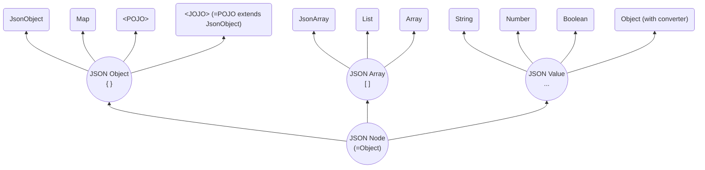

```mermaid
graph BT
    node(("JSON Node <br/> (=Object)"))
    node --> object(("JSON Object <br/> { }"))
        object --> jo("JsonObject")
        object --> map("Map")
        object --> pojo(" &lt;POJO&gt; ")
        object --> jojo(" &lt;JOJO&gt; (=POJO extends JsonObject)")
    node --> array(("JSON Array <br/> [ ]"))
        array --> ja("JsonArray")
        array --> list("List")
        array --> arr("Array")
    node --> value(("JSON Value <br/> ..."))
        value --> string("String")
        value --> number("Number")
        value --> boolean("Boolean")
        value --> converted("Object (with converter)")

```
